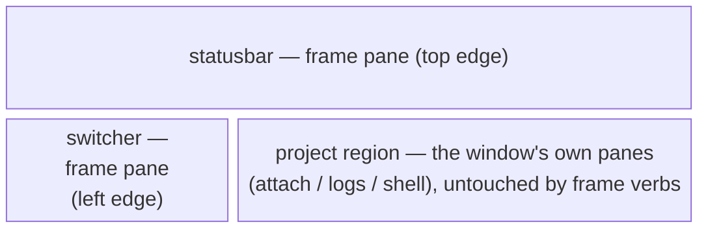
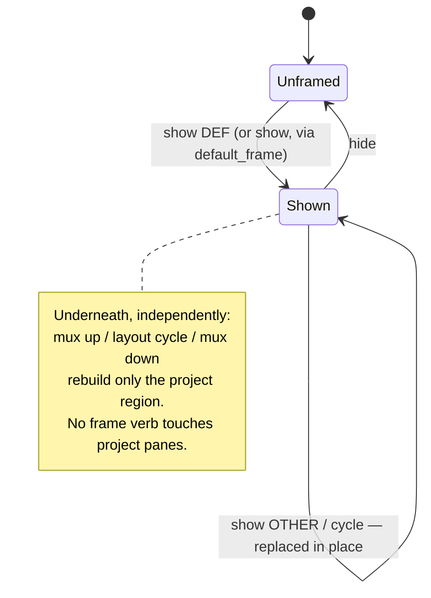
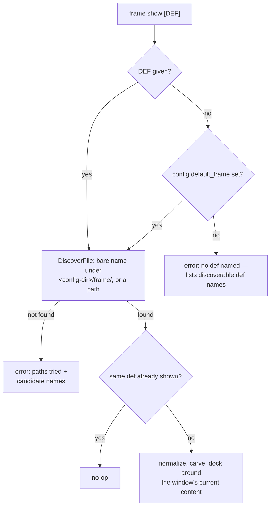
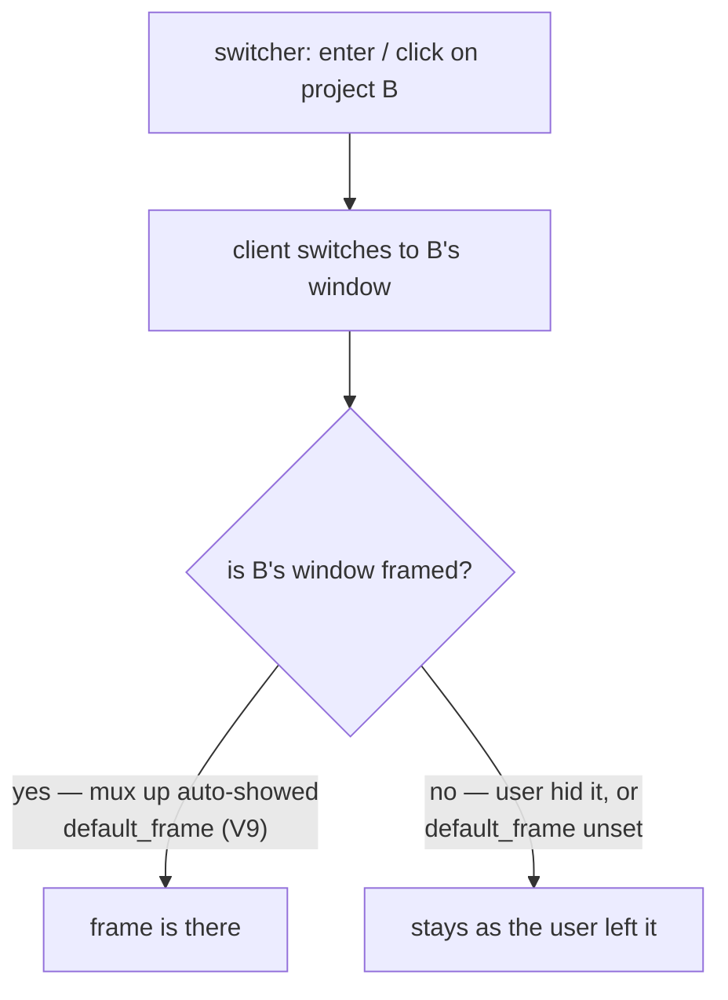

# Idea: frame verbs — user-facing frame consumption

How showing, hiding, selecting, and cycling a frame **should** feel.
Implementation cost gets no vote here; PLAN.md compromises only through
a DECISION.md entry.

The frame itself is decided upstream (parent D15/D16): panes docked to
screen edges, defined in named YAML defs, explicitly controlled. This
plan is the control surface: the verbs, the def resolution, and the
switcher becoming interactive inside that frame.

What a framed window looks like (one def: statusbar top, switcher
left):

The frame's whole lifecycle on one window is a two-state machine; the
project region lives its own life underneath it:

## Use cases

### 1. Put up the frame

A tmux user working on a project wants their switcher/statusbar
fixture around the current window. They type one short command with no
arguments — their preferred def is already named once in config
(`default_frame`) — and the frame panes appear at the edges. Whatever
was in the window (a running project dashboard, or just their shell)
is resized into the middle, untouched. Focus stays where they were
working, never in a frame pane. The command prints nothing on success —
the visible frame IS the feedback.

With an argument (`show dev`), that def is shown instead — and if a
different frame is already up, it is replaced in place, without
disturbing the project region. Show is idempotent: showing the def
that is already up is a no-op, not an error and not a flicker.

In the daily flow the user rarely types this at all: with
`default_frame` set, `mux up` shows it automatically on every window
it creates (V9). The verbs are for changing, hiding, and restoring —
the default arrives on its own. A broken `default_frame` never blocks
`mux up`: the dashboard comes up unframed with a warning naming the
def.

How the def is resolved, including the failure experience:

### 2. Take it down

`hide` removes the frame; the project region expands back to the whole
window. Running project panes never flinch. Hiding when no frame is up
is a quiet no-op — the user asked for a state, and that state holds.

### 3. Walk the defs

`cycle` advances to the next named def (stable, documented order;
wraps). The user with two or three defs (wide-screen vs laptop) flips
between them without remembering names. From no-frame, cycle shows the
first def; a def with a parse error is reported with its name and
path, not silently skipped.

### 4. Frame first, projects later

The user shows a frame on a fresh tmux window before anything is
launched (the driver already realizes the main region as a default
pane). They then launch a project from the launcher or `mux up` — it
lands inside the frame. The fixture outlives what it frames: projects
start, stop, relaunch, switch; the frame stays.

### 5. Switching projects from the switcher

Inside the docked switcher, the user moves the cursor (arrows / j k)
and presses enter — or clicks a project group — and the multiplexer
switches to that project's window (parent D6: navigation between
per-project windows). The bell marker clears on selection (parent
D22). The switcher is a navigator, not a manager: no start/stop/kill
from the docked form (V6).

Docked, the switcher never quits from a keypress — a frame pane
exiting would leave a dead hole in the fixture, so `q` is a
standalone-run affordance only (V6: the frame invokes widgets with
`--no-quit`). What the user does get from the keyboard is collapse:
pressing `z` hides the frame itself (V8), honoring D16's "the
shown/hidden switch doubles as the small-terminal collapse gesture";
`frame show` brings it back.

**Resolved (V9):** the jump lands on a framed window in the common
case, because `mux up` auto-shows `default_frame` on every window it
creates. The frame is effectively everywhere without any follow-me
mechanism; a bare window after a jump means the user hid its frame or
never set `default_frame` — either way, their own doing, left alone.

### 6. Managed frame entries

A def entry with `command:` + `managed: true` (parent D19) is a real
supervised cmdman command: it survives hide/cycle (the pane goes away,
the process does not) and shows up in `cmdman ls` like anything else.
An unmanaged `command:` entry is ephemeral — dies with its pane,
resurrected on next show. The user opts into durability per entry and
is never surprised by a background process they did not ask to keep.

### 7. Knowing what's available and what's up

The user can ask which defs exist and which one is currently shown on
which window, without reading the filesystem. Discovery failure is
helpful: `show typo-name` lists the discoverable def names; an empty
frame dir says where defs are expected to live.

## Usability requirements

- **One short verb family in one obvious place.** The verbs live where
  mux window control already lives; muscle memory from `mux up/down/ls`
  carries over.
- **Config carries the default; flags override.** `default_frame` in
  config.json means the common case is argument-less. A def named on
  the command line always wins.
- **Silence on success, specifics on failure.** Success is visible in
  the terminal itself. Failures name the def, the path tried, and the
  candidates.
- **The window targeted is the window you are in.** Inside tmux the
  current window is the target, exactly like `mux up`. A frame is a
  per-window fixture; you point at it by being there.
- **Never touch the project region.** No verb rebuilds, refocuses, or
  detaches project panes — the muxctl plan made that physically true;
  the verbs must not reintroduce it above the driver.
- **Degrade politely outside tmux**: a clear "run this inside the
  multiplexer" error, not a stack of driver noise.
- **A docked widget never self-destructs.** Quitting a widget is for
  standalone runs; inside a frame, keys navigate or collapse — they
  never leave a dead pane behind (V6).

## Open usability questions

All resolved 2026-08-13; this IDEA.md was confirmed as written by the
user (the idea gate) before the contract questions were settled. The
outcomes live in DECISION.md:

- Verb mount → **V1** (`cmdman mux frame …`).
- `select` vs `show DEF` → **V2** (folded into show).
- Discovery verb → **V4** (`frame ls` ships now).
- Docked switcher interaction set → **V6** (navigate-only; docked
  widgets get `--no-quit`, so `q` never kills a frame pane).
- Managed entry naming and hide semantics → **V7**
  (`frame-<def>-<i>`, adopt-if-running, survives hide).
- In-widget collapse gesture → **V8** (`z` runs hide).
- Frame presence across window switches (the idea gate) → **V9**
  (`mux up` auto-shows `default_frame`).
