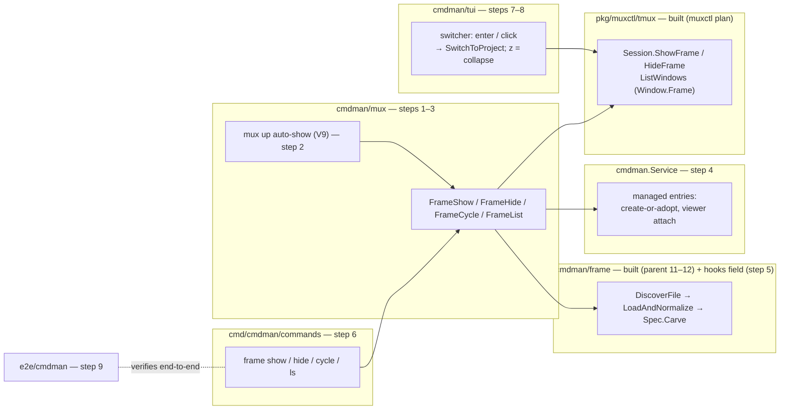

# Plan: frame verbs — user-facing frame consumption

Deliver the parent plan's step 15: the CLI verbs that show / hide /
select / cycle a frame, def resolution via `default_frame` config or
flag, the docked switcher's selection actions, managed-entry lifecycle,
and the lifecycle e2e. Everything below the verbs already exists.

Status: **finalized 2026-08-13 — idea gate passed, all open questions
resolved (DECISION.md V1–V9), traceability gate passed.** Standalone
plan (the user's call: the quicklaunch parent predates sub-plan
management and is not restructured); it delivers that parent's step 15.
The boundary ledger below is this plan's single copy.

## Inherited decisions (quoted, not summarized)

Operative sentences from the parent's
[DECISION.md](../2026-07-26-01-quicklaunch_frame_monitor_state/DECISION.md),
verbatim:

- **D15**: "Frame definitions are named standalone files under
  `<config-dir>/frame/<name>.yaml`, exactly like compose defs; which
  def applies is passed via config or a command flag. The frame is
  switched **shown / hidden / selected / cycled** by explicit user
  control."
- **D16**: "cmdman ships no default frame content. `switcher` and
  `statusbar` ship as built-in components that user defs reference. The
  shown/hidden switch doubles as the small-terminal collapse gesture."
- **D19** (via muxctl sub-plan F7 context): frame `command:` entries
  are ephemeral by default, "`managed: true` opts into cmdman
  supervision"; the muxctl plan's F7 pins: "managed-ness (D19) is
  entirely the consumer's concern above the driver — the frame verbs
  detach/preserve a managed viewer before asking the driver to remove
  its pane."
- **D17**: "A frame definition can override the default hooks." —
  owned by **this plan** (V5, step 5): a `hooks:` field on frame def
  entries.
- **D6**: switching "navigates per-project windows"; **D37**:
  "`component: <name>` resolves to `cmdman tui widget <name>`".

From the muxctl plan
([../2026-08-10-01-muxctl_first_class_frame/](../2026-08-10-01-muxctl_first_class_frame/PLAN.md),
implemented 2026-08-12): `ShowFrame` / `HideFrame`, `Window.Frame`,
`@cmdman_frame_def`, per-side teardown, focus policy — all landed and
tested; select/cycle are "consumer compositions of hide + show" (F7).

## Goal / success criteria

1. `cmdman mux frame show|hide|cycle|ls` (V1/V2/V4) work from inside
   tmux against the current window, with the def resolved
   flag > config `default_frame` > error naming candidates.
2. The docked switcher navigates: enter / mouse click switches the
   client to the selected project's window; bell clears (parent D22);
   `z` collapses the frame (V8); docked widgets never quit on a
   keypress (V6 `--no-quit`).
3. `mux up` auto-shows `default_frame` on windows it creates (V9):
   unset key → no auto-show; already-framed window untouched; a broken
   def warns and never fails the up.
4. Managed entries survive hide/cycle as supervised commands under the
   `frame-<def>-<i>` identity (V7); ephemeral entries die with their
   panes and return on show. A managed entry's `hooks:` overrides
   config `default_hooks` (D17/V5).
5. The frame survives project `mux up` / layout cycle / `mux down` /
   relaunch under it (driver-guaranteed; verified end-to-end here).
6. e2e in scripted tmux proves the parent's step-15 criterion (quoted
   verbatim): "chrome survives project switch/stop/relaunch".

## Scope

- `cmd/cmdman/commands/` verb wiring (thin, per layering rules).
- `cmdman/mux` (or sibling) service layer composing
  `frame.DiscoverFile` → `LoadAndNormalize` → `Spec.Carve` →
  `muxctl.Session.ShowFrame`/`HideFrame`, plus the `ls` read-back.
- `cmdman/frame` spec: the `hooks:` entry field (D17/V5).
- `cmdman/tui` switcher selection actions (`widget.go:209-211`
  explicitly defers them here) + the widget→tmux window-switch path,
  the `--no-quit` flag, and the `z` collapse binding.
- Managed-entry lifecycle in the verb layer (D19/F7/V7).
- Man pages for the new verbs; `default_frame` documented where config
  keys are documented.
- Lifecycle e2e in `e2e/cmdman`.

## Non-goals

- Driver work — done in the muxctl sub-plan.
- Switcher management actions (start/stop/kill from the docked form) —
  navigate-only boundary, D-recorded in V6.
- The launcher and statusbar widgets' internals (built; statusbar
  consumes state read-only and needs no interaction).
- zellij / wezterm.

## Context — what exists today (all cited from reads)

- Verb mount candidates: `cmd/cmdman/commands/mux.go` composes
  `mux up/down/ls` with `--session` (`mux.go:10-44`); `compose mux`
  mirrors it (`compose_mux.go`).
- `cmdman/mux.Run` (`run.go:86`) is the up-path: spec → identity →
  server → window → ApplyLayout. The frame verbs need the same
  session/server resolution (`resolveSessionName`, `resolveServer`,
  `run.go:177,261`) but target the *current window* only.
- Def pipeline, ready: `frame.DiscoverFile(cwd, name)`
  (`cmdman/frame/discover.go:27`, resolves bare name under
  `config.FrameConfigDir()` or a path), `LoadAndNormalize`
  (`discover.go:135-148`), `Spec.Carve(main, ComponentArgv)`
  (`carve.go:41`), `EntryPaneName` (`carve.go:22-25`),
  `frame.Entry.Managed` (`spec.go:154`), `ListNamedDefs`
  (`discover.go:97`), `WidgetArgv` (`component.go:16`).
- Config: `config.Config.DefaultFrame` (`cmdman/config/config.go:80`,
  added 2026-08-12) — loaded, consumed by nothing yet. Hook shape:
  `model.HookSet` (`cmdman/model/hook.go`), per-command at
  `model.CommandConfig.Hooks`, defaults at `config.DefaultHooks`.
- Driver: `muxctl.Session.ShowFrame(ctx, root, mainName, defName)` /
  `HideFrame(ctx)` (`pkg/muxctl/session.go:88,100`);
  `muxctl.Window.Frame` + `StateKeyFrameDef` for read-back
  (`driver.go:54,88`).
- Widgets: `cmdman tui widget switcher|statusbar|launcher` all run
  standalone (`cmd/cmdman/commands/tui_widget.go:22-24`); switcher
  cursor moves but "Selection-driven window switching (enter) and
  mouse selection arrive with the frame verbs"
  (`cmdman/tui/widget.go:209-211`).

## Public surface delta

Prose may explain; **this block defines**. Anything user-visible not
here is out of scope by definition.

```
# CLI — mounted under mux (V1); -s/--session inherited from the mux family
cmdman mux frame show [DEF]   # DEF: bare name or path; absent -> config default_frame
                              # show OTHER replaces in place — D15's "selected" (V2);
                              # showing the def already up is a no-op
cmdman mux frame hide         # no-op when unframed
cmdman mux frame cycle        # sorted ListNamedDefs order, starts after the shown
                              # def, wraps; from no-frame shows the first (V3)
cmdman mux frame ls           # defs on disk + which def is shown on which window (V4)
  # no other flags on the frame verbs

# widget entrypoint (V6): unbind q/quit; frame panes always get it via WidgetArgv
cmdman tui widget <switcher|statusbar|launcher> --no-quit

# docked switcher keys (V6/V8): arrows / j k move, enter / mouse click switch
#   to the project's window, z collapses (runs frame hide; no-op when unframed);
#   q quits only in standalone runs (without --no-quit)

# config.json (key landed 2026-08-12; consumption is this plan)
# V9: names the default def AND auto-applies it on every window
# `mux up` creates; unset = no auto-show
{ "default_frame": "dev" }

# frame def YAML — new entry key (V5, D17)
# managed entries only; on an ephemeral entry it warns and is ignored
entries:
  - command: ["tail", "-f", "app.log"]
    managed: true
    hooks: {}                 # model.HookSet, same shape as config default_hooks

# managed frame entries (V7): one supervised command per managed entry
#   name: frame-<def>-<i>; show adopts-if-running else creates; hide/cycle
#   detach the viewer and leave the command running (F7)
```

```go
// cmdman/mux (new file frame.go) — service layer the CLI wraps
func FrameShow(ctx context.Context, opts FrameOptions) error
func FrameHide(ctx context.Context, opts FrameOptions) error
func FrameCycle(ctx context.Context, opts FrameOptions) error
func FrameList(ctx context.Context, opts FrameOptions) (FrameListResult, error) // V4

type FrameOptions struct {
    Def     string // "" -> config default_frame
    Session string // "" -> current session inside tmux
    Config  cmdman.CmdmanConfig
    Svc     *cmdman.Service // managed entries + ComponentArgv resolution
}

type FrameListResult struct { // shape rough; presentation stays in cmdman/cli
    Defs  []string          // sorted discoverable def names
    Shown map[string]string // window -> shown def name
}
```

```go
// cmdman/frame — spec surface (V5, D17)
type Entry struct {
    // ...existing fields...
    Hooks model.HookSet `yaml:"hooks,omitempty"` // managed only; overrides default_hooks
}
```

```go
// cmdman/tui — switcher selection actions (V6); Backend gains
SwitchToProject(ctx context.Context, identity string) error
```

No proto/RPC change. No store schema change. No new config keys beyond
the already-landed `default_frame`. Durable state vocabulary unchanged
(`@cmdman_frame`, `@cmdman_frame_def` are the muxctl plan's).

## Approach — flow through the components

The delivery counterpart to IDEA.md's workflow diagrams: which
component and which step delivers each leg. Everything in the two
"built" groups exists today; this plan adds the edges into them.



`frame show`, with the managed-entry branch (D19):

```mermaid
sequenceDiagram
    actor U as user
    participant C as cmd (step 6)
    participant M as mux.FrameShow (step 1)
    participant F as cmdman/frame (built + step 5)
    participant S as cmdman.Service (step 4)
    participant D as tmux driver (built)

    U->>C: cmdman mux frame show [DEF]
    C->>M: FrameOptions{Def, Session}
    M->>F: DiscoverFile(cwd, def or default_frame)
    F-->>M: normalized Spec
    opt each managed: true entry
        M->>S: adopt frame-<def>-<i> if running, else create (V7)
        note over M,S: entry hooks: -> CommandConfig.Hooks (V5)
        S-->>M: running; pane argv becomes the viewer (attach)
    end
    M->>F: Spec.Carve(placeholder main, ComponentArgv)
    F-->>M: muxctl.PaneSpec tree
    M->>D: ShowFrame(root, mainName, defName)
    D-->>M: frame panes docked + stamped, focus in main
```

`frame hide` / the hide half of cycle — F7's order is the contract
("the frame verbs detach/preserve a managed viewer before asking the
driver to remove its pane"):

```mermaid
sequenceDiagram
    participant M as mux.FrameHide (step 1)
    participant S as cmdman.Service (step 4)
    participant D as tmux driver (built)

    M->>D: read Window.Frame (which def is up; absent → no-op)
    opt each managed entry of that def (F7)
        M->>S: quiesce the viewer in the pane
        note over M,S: supervised command keeps running
    end
    M->>D: HideFrame()
    D-->>M: frame panes killed, @cmdman_frame_def cleared,<br/>project region expands
```

## Boundary ledger

Every deliverable the frame feature needs end-to-end, with its owner.
An empty owner cell is a defect, not a footnote.

| Deliverable | Owner | State |
| --- | --- | --- |
| Frame def grammar, discovery, carve | parent steps 11–12 (`cmdman/frame`) | done |
| Widget entrypoint `tui widget <name>` | parent step 13 (D37) | done |
| Driver: ShowFrame/HideFrame, stamps, per-side teardown, enumeration | muxctl plan steps 1–9 | done |
| `default_frame` config key | added 2026-08-12 (post-hoc) | done |
| `default_frame` consumption | **this plan** (step 1, def resolution) | planned |
| `mux up` auto-show of `default_frame` (V9) | **this plan** (step 2) | planned |
| Frame verbs CLI incl. `ls` (V1/V2/V4) | **this plan** (step 6) | planned |
| Switcher selection → window switch (D6) | **this plan** (step 7) | planned |
| Widget `--no-quit` / docked key policy (V6) | **this plan** (step 7) | planned |
| Collapse gesture `z` (D16/V8) | **this plan** (step 8) | planned |
| Managed entry lifecycle (D19/F7/V7) | **this plan** (step 4) | planned |
| Hook override in frame defs (D17/V5) | **this plan** (step 5) | planned |
| Lifecycle e2e (parent step-15 verify) | **this plan** (step 9) | planned |
| Man pages for verbs + config key | **this plan** (step 6) | planned |

## Implementation steps

1. **Def resolution + FrameShow/FrameHide** in `cmdman/mux`:
   flag > `Config.DefaultFrame` > error listing `ListNamedDefs`;
   compose Discover→Normalize→Carve→ShowFrame with the placeholder
   main leaf; idempotent show (read `Window.Frame` first — same def
   is a no-op, different def hides then shows). Verify: unit tests
   against scripted tmux, as `cmdman/mux/frame_test.go` already does
   for the layer.
2. **`mux up` auto-show (V9)**: after a successful up on an unframed
   window, `cmdman/mux.Run` (`run.go:86`) shows `default_frame` when
   the key is set; def-resolution failure warns and never fails the
   up; an already-framed window is untouched. Verify: up on a fresh
   window yields the framed window; up with the key unset stays bare;
   up under a different shown def leaves that def alone.
3. **Cycle (V3)** as hide+show composition over sorted
   `ListNamedDefs`, starting after the currently shown def
   (`Window.Frame`), wrapping; from no-frame shows the first def.
   Verify: three cycles over two defs wrap correctly; cycle from
   no-frame shows the first.
4. **Managed entries (D19/F7/V7)**: supervised command
   `frame-<def>-<i>` per `managed: true` entry — adopt if running,
   else create; pane runs the viewer (attach); detach viewer before
   hide/cycle kills the pane. Verify: hide leaves the managed command
   running in `cmdman ls`; show re-attaches without duplicating it.
5. **Frame def `hooks:` field (D17/V5)**: `Hooks model.HookSet` on
   `frame.Entry` (`cmdman/frame/spec.go`), validated in Normalize
   (`hooks:` on an ephemeral entry warns and is ignored); the step-4
   create path sets `CommandConfig.Hooks` from it. Verify: unit — a
   def with hooks yields the supervised command's config carrying
   them; ephemeral-entry hooks warn.
6. **CLI wiring** under `cmdman mux frame` (V1) — show/hide/cycle/ls,
   `show DEF` replacing in place (V2, documented in the man page) —
   plus man pages and `default_frame` docs. Verify: help text,
   outside-tmux error, def-not-found lists candidates, `ls` shows
   defs and shown-state.
7. **Switcher selection actions (V6)**: enter/click →
   `SwitchToProject`; bell clears (parent D22/D24); `--no-quit` flag
   on the widget entrypoint unbinds q/quit; `frame.WidgetArgv`
   appends `--no-quit`. Verify: widget unit tests + driver-level
   switch test; `q` is inert under `--no-quit`.
8. **Collapse gesture (V8)**: `z` in the docked switcher runs frame
   hide; quiet no-op when unframed. Verify: widget test + scripted
   tmux shows the frame gone and the supervised commands alive.
9. **Lifecycle e2e** (`e2e/cmdman`): show → `mux up` under it →
   layout cycle → project switch via switcher → `mux down` → hide;
   the frame and its supervised commands survive per parent step 15.

## Testing / verification

- Unit tests beside `cmdman/mux` and `cmdman/tui` as those packages
  already do (scripted tmux on temp sockets).
- e2e in `e2e/cmdman` (TestMain-built binary) for the full lifecycle —
  the parent's step-15 verify line, quoted: "e2e in scripted tmux;
  chrome survives project switch/stop/relaunch".
- Known driver quirk to design around (muxctl STATUS follow-ups):
  1-row bars realize at 0 usable rows under `pane-border-status top`;
  defs in tests use ≥2-row bars until sized.

## Risks

- **Managed lifecycle is the only genuinely new state machine here** —
  everything else is composition. Getting adopt-vs-create and
  hide-survival wrong creates orphan supervised commands. V7's
  same-name-adopts trade-off (a changed entry command adopts the old
  process) is accepted and documented; content-hash identity is the
  upgrade path.
- **Switcher scope creep**: bounded — V6 D-records navigate-only; any
  management action in the docked form is out until re-decided.
- **Double-show stacking**: the driver deliberately stacks on repeated
  ShowFrame; the verb layer must always hide-then-show (muxctl STATUS
  follow-up names this).

## Open questions

None — all resolved 2026-08-13 (idea gate + Q1–Q9); see DECISION.md
V1–V9.
