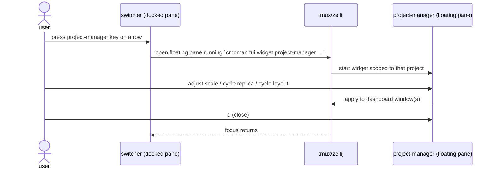
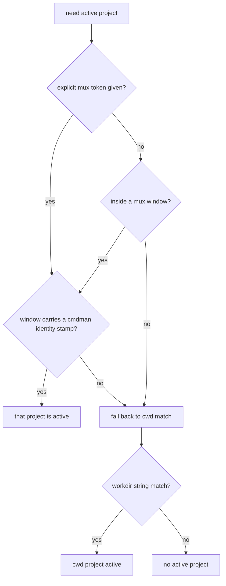

# IDEA — project-manager widget

How it should be. Blind to implementation cost; PLAN.md compromises against
this only through a DECISION.md entry.

## One-line statement

A single small TUI widget, `project-manager`, that is a **shortcut** for the
mux operations of a running compose project — **replica scale**, **which
replica a pane shows** (cycle of command), and **which mux layout is applied**
(cycle of layout) — reachable both directly from the CLI and from the switcher
widget, where it opens as a floating pane over the dashboard.

## Motivation — why this exists

Today every one of these mux operations requires either:

- **a shell kept open inside the dashboard** (cd'd to the project) just to
  run `cmdman compose scale/mux cycle-scale/mux up` — a pane wasted on
  occasional one-off commands; or
- **a long, tedious CLI invocation through the mux command prompt**
  (tmux `prefix+:` → typing the full `cmdman compose …` command by hand,
  no completion, no visibility of current state).

project-manager is the convenience shortcut: summon it with one keystroke,
see the current scale/replica/layout state at a glance, adjust with single
keys, dismiss. It adds no new capability — it removes the friction of
reaching the capabilities that already exist.

## Vocabulary (confirmed — D2)

| User's term        | Meaning in cmdman today                                                        | Existing surface                        |
| ------------------ | ------------------------------------------------------------------------------ | --------------------------------------- |
| scale              | replica **count** of a service                                                 | `cmdman compose scale SERVICE=NUM` (CLI only) |
| cycle of command   | which **replica** of a scaled command the dashboard pane shows                 | `cmdman compose mux cycle-scale` (CLI only)   |
| cycle of layout    | which named `mux: layouts:` entry is applied to the dashboard window           | `compose mux up [layout]`, Backend `CycleMux`/`ListLayouts`/`ApplyLayout` (full TUI Layout tab) |

## Use cases

### UC1 — Direct CLI invocation

- **Actor**: a developer inside (or outside) a tmux/zellij session, in some
  directory, with a compose project up.
- **Intent**: adjust the project without a dedicated shell in the dashboard
  and without typing a full `cmdman compose …` command through the mux
  `prefix+:` prompt — bump a service to 3 replicas, flip the pane to replica
  2, switch layout.
- **Walkthrough**:
  1. Runs `cmdman tui widget project-manager` — from a shell, or with one
     keystroke via a user-configured mux binding that opens it in a popup
     (same pattern as the launcher's documented
     `bind-key … display-popup -E … 'cmdman tui widget launcher'`).
     A mux binding passes the source window explicitly as an **opaque,
     driver-agnostic mux token** — e.g. tmux
     `… display-popup -E 'cmdman tui widget project-manager --mux-token #{window_id}'`
     expands to `--mux-token @5` — because a popup's own process context may
     not resolve to the window the user was looking at. The token's format
     belongs to the active driver (tmux window id `@N`; zellij's equivalent
     later); cmdman never parses it, only hands it to the driver.
  2. The widget determines the active project — from the mux window it sits in
     first, from cwd as fallback (UC3).
  3. It shows the project's commands with their scale badges, the current
     replica position of each cycling pane, and the layout list with the
     active one marked.
  4. Keys adjust scale up/down per service, cycle the shown replica, and
     cycle/apply a layout. Every action gives immediate visual feedback
     (badge/marker updates) and takes effect on the live dashboard.
  5. `q` leaves; the dashboard reflects everything done.

### UC2 — Summoned from the switcher

- **Actor**: a developer with a cmdman frame docked, switcher pane focused.
- **Intent**: manage a project seen in the switcher list without opening a
  full TUI or typing a CLI command.
- **Walkthrough**:
  1. In the switcher, presses the project-manager key on a project row.
  2. The switcher opens `project-manager` in a **floating pane** scoped to
     that project, via the same mux auto-detect + flags path `cmdman tui
     --popup` uses — so tmux `display-popup` works today, and when a zellij
     (or other) floating-pane driver lands in that path later, the summon
     works there transparently with no switcher change (D1).
  3. The user adjusts scale / replica / layout as in UC1 step 4.
  4. Closes the popup; focus returns to the switcher; the dashboard reflects
     the changes.

### UC3 — Project detection also uses the window (TUI behavior change)

- **Actor**: any TUI surface that needs "the active project" — today detected
  from **cwd only** (`Backend.Cwd()`, string-matched against project workdirs).
- **Problem being fixed**: sitting in a project's dashboard window but with a
  cwd elsewhere (popup shells, frame panes, `--workdir` mismatch) makes the
  TUI blind to the project that is visibly in front of the user.
- **Should be**: detection is **window-first, cwd-fallback** — if the process
  runs inside a mux window owned by a cmdman project (`@cmdman_window`
  identity stamp), that project is the active one; otherwise cwd matching
  applies as today. Additive: nothing that works today stops working.

Probe order: **explicit mux token** (from a mux keybinding; the switcher
summon instead passes the project explicitly — D9) → **enclosing window** →
**cwd**. The token exists because popups
and floating panes run detached from the window the user summoned them
from; passing `#{window_id}` (or the driver's equivalent) at bind time is
the only reliable way to carry that context in.

## Usability requirements

- **Invocation ergonomics**: `cmdman tui widget project-manager` mirrors the
  existing `switcher`/`statusbar`/`launcher` subcommands; the switcher key is
  a single keystroke, discoverable in its help line.
- **Defaults match the common case**: with no arguments, the widget targets
  the detected active project (UC3). From the switcher, it targets the
  project under the cursor.
- **Feedback while running**: every scale/cycle action re-renders the badges
  and layout marker immediately; slow backend calls show a pending state
  rather than freezing.
- **Failure experience** (D4, amended by D10): invoked with no detectable
  project → clear message naming each probe that failed (mux token when
  given, window, cwd), not a stack trace.
  Invoked outside any mux window → runs normally with cwd-based detection.
  Switcher summon where a floating pane is unavailable (plain terminal, or a
  mux the popup path does not support yet) → the switcher shows a one-line
  inline message explaining that a popup is not available here.
- **Discoverability**: listed in `cmdman tui widget --help`, documented in
  `doc/man/cmdman-tui.1.md` alongside the launcher's popup bind-key example,
  including a ready-to-paste bind-key snippet for one-keystroke summoning
  that already wires `--mux-token #{window_id}` in.
- **Shortcut, not new capability**: every action maps 1:1 onto an existing
  CLI/Backend operation; the widget never grows semantics of its own.

## Resolved idea-level decisions

- D1 — floating-pane summon reuses the `cmdman tui --popup` path's
  auto-detect + flags seam; new drivers work transparently later (tmux only
  ships now).
- D2 — vocabulary mapping confirmed as tabled above.
- D3 — window-first, cwd-fallback detection applies **TUI-wide** at the
  Backend seam (UC3 as written).
- D4 — fallback UX as stated under Failure experience above.
- D10 — the widget accepts an explicit, driver-agnostic mux token CLI
  argument (tentative flag name `--mux-token`) as the highest-priority
  detection probe, so mux keybindings can pass the source window in.
