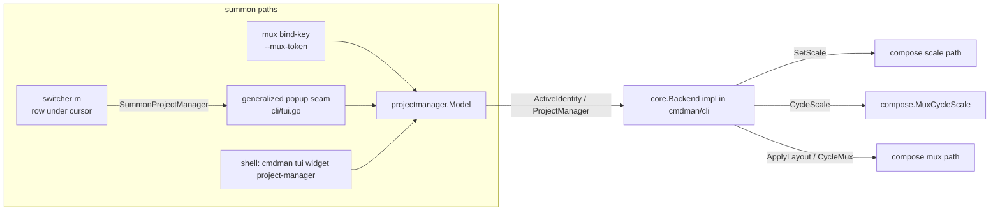

# PLAN — project-manager widget

One-line summary: add a `project-manager` TUI widget — a convenience shortcut
controlling replica scale, shown-replica cycling, and layout cycling for the
active compose project — with token → window → cwd project detection applied
TUI-wide, invocable from the CLI (incl. mux keybindings) and from the
switcher via a floating pane.

Idea gate passed 2026-08-16; IDEA.md is the authority on behavior.

## Goal / success criteria (derived from IDEA.md)

- `cmdman tui widget project-manager` runs the widget standalone and it can,
  against a live project: set a service's replica count, cycle the shown
  replica of a scaled command, and cycle/apply a mux layout — each action a
  1:1 wrap of an existing CLI/Backend operation (IDEA "shortcut, not new
  capability").
- A mux keybinding can summon it in a popup passing
  `--mux-token "#{window_id}"`, and the widget targets that window's project
  (D10).
- The switcher's `m` key summons it in a floating pane for the row under the
  cursor (D7/D9), via the shared popup seam (D1); dashboard reflects changes
  on close.
- Active-project detection everywhere in the TUI probes: explicit mux token →
  enclosing mux window identity stamp → cwd match (D3/D10); existing
  cwd-only behavior is the unchanged fallback.

## Scope

- Widget registration + standalone model under
  `cmdman/tui/widget/projectmanager/`.
- `core.Backend` additions: `ActiveIdentity`, `ProjectManager` (info load),
  `SetScale`, `CycleScale`, `SummonProjectManager`.
- Token/window/cwd detection at the Backend seam, consumed TUI-wide.
- Switcher `m` keybinding + generalized popup launcher.
- CLI subcommand + flags; man-page updates with a bind-key snippet.

## Non-goals

- A zellij driver under `pkg/muxctl/` (D1: the summon goes through the shared
  `cmdman tui --popup` seam; zellij keeps erroring at that one seam until a
  driver lands, then works transparently).
- A first-class floating-pane primitive on the muxctl `Driver` contract (D5).
- Docking project-manager in a frame (D6: popup-only; stays out of
  `builtinComponents` like launcher).
- New scale/cycle/layout semantics — every action wraps an existing path.

## Context (verified against current source)

- Widget registry: `cmdman/tui/internal/core/widget.go:14-41` (`Widget`
  consts + `WidgetDefs`); dispatch `cmdman/tui/tui.go:41-56`; CLI wiring
  `cmd/cmdman/commands/tui_widget.go:10-53` (persistent `--no-quit`, shared
  `runTuiWidget` → `cli.RunTUIWidget(ctx, svc, widget, workDir, noQuit)`),
  one file per widget (`tui_widget_switcher.go` shape).
- `core.Backend` (`cmdman/tui/internal/core/backend.go:93-203`): projects are
  identified by `projectName, composeFile string` pairs across methods
  (`CycleMux`, `ListLayouts`, `ApplyLayout`, `ComposeUp`, …);
  `ProjectInfo.Identity` (backend.go:60-64) is the opaque mux ownership
  stamp `SwitchToProject` takes. Layout methods already exist
  (backend.go:129-145, `LayoutsInfo` backend.go:71-83).
- Detection today: `Backend.Cwd()` (backend.go:99-102, impl
  `cmdman/cli/tui_backend.go:44`), consumed at
  `cmdman/tui/widget/internal/panel/switcher.go:62-63` (workdir string
  equality) and `cmdman/cli/tui_backend_mux.go:68-78`
  (`resolveLayoutSelection` — the existing "prefer X, fall back" pattern).
- Window identity primitives (exist, unused by TUI): `Server.CurrentWindowID`
  (`pkg/muxctl/driver.go:253-265`), `ListWindows`/`ReadWindowState`
  (driver.go:195-224), `@cmdman_window` ownership stamp.
- Scale ops (CLI-only today): replica count
  `cmd/cmdman/commands/compose_scale.go` (parse `SERVICE=NUM`, override
  `spec.Commands[i].Scale`, scoped `compose.Service.Up`); shown-replica
  cycling `cmd/cmdman/commands/compose_mux_cycle-scale.go` →
  `compose.Service.MuxCycleScale` (`cmdman/compose/mux.go:257-305`) →
  `mux.CycleScale`, persisted as `@cmdman_scale` window state
  (`muxctl.StateKeyScale`). TUI scale surface (post-D44 main work, re-grounded
  2026-08-16): `CommandInfo.ScaleIndex/ScaleCount` (backend.go:26-34) are now
  **filled** from the reserved replica labels via `compose.ScaleOf`
  (`cmdman/compose/plan.go:195`); the read-only `ScaleBadge` renders
  index-only ` [i]` (`cmdman/tui/internal/core/render.go:193-197`). Upstream
  D44 pins that `LabelScale` — and hence `ScaleCount` — goes stale after
  `compose scale`; D11 records what the widget uses instead.
- Popup machinery: `cmdman/cli/tui.go:319-353` (`runTmuxPopup`, raw
  `tmux display-popup`, hardwired to launch `tui __child`);
  `resolvePopupDriver` (tui.go:238-251) auto-detects and errors for zellij.
  Launcher popup precedent is a user bind-key (`doc/man/cmdman-tui.1.md:70`).
- Frame components: `builtinComponents` = statusbar, switcher only
  (`cmdman/frame/spec.go:38-42`); launcher deliberately excluded.
- Switcher keys taken: `j/k/down/up`, `enter`, `z`, `q/ctrl+c/ctrl+d`
  (`cmdman/tui/widget/internal/panel/panel.go:194-216`); `m` is free (D7).

## Approach

- **Standalone model**, launcher-style (`cmdman/tui/widget/launcher/`
  precedent): its key vocabulary (two focus zones, scale/cycle keys) shares
  nothing with `panel.Model`. New package
  `cmdman/tui/widget/projectmanager/`.
- **Detection as one Backend method.** `ActiveIdentity(ctx)` resolves the
  active project's mux identity from the explicit token (carried into the
  backend at construction) or the enclosing window; callers that get
  `ok=false` fall back to the existing `Cwd()` match. The switcher's Active
  mark and `resolveLayoutSelection` switch to identity-first matching, cwd
  fallback — one function, every consumer inherits it (D3).
- **1:1 operation wrapping.** `SetScale` wraps the `compose scale` path;
  `CycleScale` wraps `MuxCycleScale`; layout actions reuse the existing
  `ListLayouts`/`ApplyLayout`/`CycleMux`. One aggregate load call
  (`ProjectManager`) feeds the whole view, following the `LayoutsInfo`
  projection convention.
- **Summon via the generalized popup seam.** Extract the child-argv from the
  `tui.go` popup path so it can launch `tui widget project-manager …` as
  well as `tui __child`; the switcher's `m` calls a new Backend method that
  uses it. Driver auto-detect and geometry flags/config carry over
  unchanged, so a future zellij popup implementation lights up all callers
  at once (D1/D5).
- Rejected: extending `panel.Model` (key/zone semantics diverge too far);
  driver-level floating-pane primitive (D5); dockable component (D6).



## Public surface delta

The fenced code defines the delta; anything user-visible not listed here is
out of scope by definition.

### Widget registry + CLI

```go
// cmdman/tui/internal/core/widget.go
const (
    // ...existing...
    // WidgetProjectManager is the project-manager shortcut panel: scale,
    // shown-replica cycling, and layout cycling for one project. Popup-
    // summoned like the launcher; never a frame component (D6).
    WidgetProjectManager
)

var WidgetDefs = []WidgetDef{
    // ...existing...
    {WidgetProjectManager, "project-manager"},
}
```

```console
# direct
$ cmdman tui widget project-manager
# from a mux keybinding: explicit source-window token (opaque to cmdman)
$ cmdman tui widget project-manager --mux-token @5
# explicit project target (what the switcher summon passes) — compose's
# flag convention: -w/--workdir, -f/--file, -p/--project-name
$ cmdman tui widget project-manager --workdir ~/proj/api --file ./example.compose.yaml
```

New flags on `tui widget project-manager` (plus inherited `--no-quit`;
`--workdir` already exists on sibling widgets and doubles as the explicit
target):

- `--mux-token string` — opaque mux window token; highest-priority detection
  probe (D10). cmdman never parses it; the driver resolves it.
- `--workdir string` — as on sibling widgets, overrides the cwd the fallback
  probe matches — which is also how the switcher summon targets a row's
  project explicitly (D9, amended: no separate `--project` flag).
- `--file string`, `--project-name string` — compose-file path and project
  name, mirroring `cmdman compose`'s persistent `-f`/`-p` flags
  (`cmd/cmdman/commands/compose.go:33-48`), for disambiguation when a
  workdir holds more than one project.

Documented tmux binding (`doc/man/cmdman-tui.1.md`, beside the launcher's):

```tmux
bind-key -n M-p display-popup -E -w 80% -h 60% \
  'cmdman tui widget project-manager --mux-token "#{window_id}"'
```

### core.Backend delta

```go
// cmdman/tui/internal/core/backend.go
type Backend interface {
    // ...existing...

    // ActiveIdentity resolves the active project's mux ownership stamp
    // (ProjectInfo.Identity) from, in order, the explicit mux token the
    // backend was constructed with, then the enclosing mux window. ok=false
    // means neither probe answered; callers fall back to Cwd() matching.
    ActiveIdentity(ctx context.Context) (identity string, ok bool)

    // ProjectManager returns everything the project-manager widget renders
    // for one project (see ProjectManagerInfo).
    ProjectManager(ctx context.Context, projectName, composeFile string) (ProjectManagerInfo, error)

    // SetScale sets the replica count of one service, wrapping the compose
    // scale path (ephemeral override + Up scoped to that service).
    SetScale(ctx context.Context, projectName, composeFile, service string, replicas int) error

    // CycleScale changes which replica the command's dashboard pane shows,
    // wrapping compose.Service.MuxCycleScale: set > 0 selects that 1-based
    // replica; set == 0 advances to the next.
    CycleScale(ctx context.Context, projectName, composeFile, command string, set int) error

    // SummonProjectManager opens the project-manager widget in a mux
    // floating pane targeting the given project — the switcher's m (D7/D9).
    // Where no popup support exists the error is shown inline (D4).
    SummonProjectManager(ctx context.Context, projectName, composeFile string) error
}

// ProjectManagerInfo aggregates the project-manager view data, following the
// LayoutsInfo projection convention.
type ProjectManagerInfo struct {
    Project  string
    Path     string
    Services []ServiceScaleInfo
    Layouts  LayoutsInfo
}

// ServiceScaleInfo is one service row: desired replica count, the 1-based
// replica its dashboard pane currently shows (0 = unknown / not cycling),
// and whether the mux leaf is an unpinned cycle target.
//
// Replicas is the live per-service instance count in the store — the number
// of the project's commands carrying that service's labels, compose-ps
// style, exited replicas included — NOT LabelScale/CommandInfo.ScaleCount,
// which D44 pins as stale after `compose scale` (D11). The widget's +/- use
// Replicas as the SetScale base.
//
// Shown comes from the project's persisted @cmdman_scale state via
// compose.Service.MuxScaleState (cycle-scale writes every matching dashboard
// window, so the windows' states should agree — the step-1 spike confirms
// that consistency).
type ServiceScaleInfo struct {
    Name     string
    Replicas int
    Shown    int
    Cyclable bool
}
```

### cli entry surface

```go
// cmdman/cli/tui.go — RunTUIWidget grows an options struct (compat is not a
// concern); the popup launcher is generalized from `tui __child`-only to an
// arbitrary widget argv, keeping driver auto-detect + geometry handling.
type TUIWidgetOptions struct {
    Widget   tui.Widget
    WorkDir  string
    NoQuit   bool
    MuxToken    string // opaque driver token (D10); "" = unset
    File        string // compose file path (compose -f convention)
    ProjectName string // project name override (compose -p convention)
}
func RunTUIWidget(ctx context.Context, svc *cmdman.Service, opts TUIWidgetOptions) error
```

### Base-layer delta (cmdman/compose, cmdman/cli)

```go
// cmdman/compose — NEW: replica-count scale as a Service op. The
// override+scoped-Up core moves here out of
// cmd/cmdman/commands/compose_scale.go:90-127 (applyScaleOverrides et al.),
// per the thin-entrypoint rule; SERVICE=NUM arg parsing stays in cmd, and
// the existing `cmdman compose scale` command is refactored to call this —
// one implementation serving both the CLI and the widget backend.
// Naming follows the compose op convention (<Op>Option, no domain prefix).
type ScaleOption struct {
    File        string
    ProjectName string
    WorkDir     string
    Scales      map[string]int // service name -> desired replica count
}
func (s *Service) Scale(ctx context.Context, opts ScaleOption) error

// cmdman/compose — NEW: exported read of the shown-replica positions the
// dashboards persist as @cmdman_scale state — today read only internally by
// MuxUp (cmdman/compose/mux.go:70 via mux.ReadScaleState). Feeds
// ServiceScaleInfo.Shown. Selection fields mirror the other Mux* ops; exact
// shape aligned with MuxLsOption at implementation.
type MuxScaleStateOption struct {
    File        string
    ProjectName string
    WorkDir     string
}
func (s *Service) MuxScaleState(ctx context.Context, opts MuxScaleStateOption) (map[string]int, error)
```

```go
// cmdman/cli — LaunchTUIPopup (cli/tui.go:170) generalized from launching
// only `tui __child` to launching an arbitrary child argv (used by both the
// existing full-TUI popup and SummonProjectManager). Signature change;
// compat is not a concern. Driver auto-detect (resolvePopupDriver) and
// geometry handling are unchanged.
```

- **`pkg/muxctl`: no change.** The mux token is defined as a driver-native
  window id — the same form `CurrentWindowID` returns (`@7`, driver.go:253)
  and `ReadWindowState`/`FindPane`/`ListWindows` already accept
  (driver.go:206-224). Token resolution is therefore existing surface; the
  step-1 spike only confirms error behavior for a stale/bogus token.
- **`cmdman/mux`: no change.** `CycleScale`, `ReadScaleState`,
  `CollectCycleTargets` are already exported (`cmdman/mux/cycle_scale.go`,
  `targets.go`).

### Widget keys (project-manager)

| Key                 | Zone     | Action                                          |
| ------------------- | -------- | ----------------------------------------------- |
| `j`/`k`/arrows      | both     | move selection in the focused list              |
| `tab`               | —        | switch focus: services ⇄ layouts                |
| `+`/`=` , `-`       | services | replica count +1 / −1 (`SetScale`)              |
| `l`/`right`, `h`/`left` | services | shown replica next / previous (`CycleScale`) |
| `enter`             | layouts  | apply selected layout (`ApplyLayout`)           |
| `c`                 | layouts  | cycle to next layout (`CycleMux`)               |
| `r`                 | —        | reload (`ProjectManager`)                       |
| `q`/`ctrl+c`        | —        | quit (absent under `--no-quit`)                 |

### Switcher delta

| Key | Action                                                              |
| --- | ------------------------------------------------------------------- |
| `m` | summon project-manager in a floating pane for the row under cursor |

### Explicitly unchanged surface

- `cmdman/frame/spec.go` `builtinComponents` — project-manager is **not**
  added (D6); `frame` rejects it as a component name, like launcher.

## Implementation steps

1. **Spike: token + window resolution contexts.** Verify in a live tmux:
   what `CurrentWindowID` returns inside `display-popup` and inside frame
   panes; whether `ReadWindowState`/`ListWindows` can resolve a raw
   `#{window_id}` token (`@N`) as-is or the driver needs a small
   `ResolveWindow`-style addition; and that `@cmdman_scale` state agrees
   across a project's dashboard windows after cycle-scale (backs
   `ServiceScaleInfo.Shown`). Record findings in `NOTES.md` here; gates
   the detection design detail in step 3. Verifiable: NOTES.md states the
   observed behavior with commands used.
2. **Registration plumbing (stub widget).** `WidgetProjectManager` const +
   `WidgetDefs` row (`core/widget.go`); dispatch case (`tui/tui.go`);
   `cmd/cmdman/commands/tui_widget_projectmanager.go` with
   `--mux-token/--file/--project-name` (+ the sibling widgets' `--workdir`); `cli.RunTUIWidget` → `TUIWidgetOptions`
   refactor (all callers updated, incl. `frame/component.go` argv path which
   must keep resolving only builtin components). Verifiable:
   `cmdman tui widget project-manager` launches a stub view; `frame` still
   rejects `component: project-manager`.
3. **Detection.** Implement `ActiveIdentity` in `cmdman/cli/tui_backend*.go`
   (token probe per step-1 findings, then enclosing-window probe via
   `CurrentWindowID` + identity read); thread `MuxToken` from
   `TUIWidgetOptions` into `serviceBackend` construction. Consume TUI-wide:
   switcher Active mark (`panel/switcher.go:62-63` becomes identity-first,
   workdir-equality fallback) and `resolveLayoutSelection`
   (`tui_backend_mux.go:68-78` gains the identity probe ahead of its
   existing chain). No-project failure message names each failed probe —
   token when given, window, cwd (D4 as amended by D10). Verifiable: e2e — switcher marks the project Active when run inside
   its dashboard window with an unrelated cwd.
4. **Backend operations.** Base first: hoist `compose.Service.Scale` out of
   `cmd/.../compose_scale.go` and refactor `runComposeScale` to call it —
   the cmd file keeps only `parseScaleArgs` and the invocation;
   `applyScaleOverrides` leaves cmd entirely. Add
   `compose.Service.MuxScaleState` (see Base-layer delta).
   Then `ProjectManagerInfo`/`ServiceScaleInfo` + `ProjectManager` (reads
   `MuxScaleState` for Shown; Replicas = live instance count per D11),
   `SetScale` (wraps `Scale`), `CycleScale` (wraps `MuxCycleScale`). Verifiable: unit tests against a
   fake backend; e2e driving the methods against a live project.
5. **Widget model/view.** `cmdman/tui/widget/projectmanager/`: standalone
   Model per the key table; badges/markers via existing `core/render.go`
   helpers; pending state during backend calls; error line for failures.
   Verifiable: model unit tests (selection, zone switch, key → command
   mapping, pending/error rendering) with a fake Backend.
6. **Switcher summon + popup generalization.** Generalize the
   `cli/tui.go` popup path to take a child argv (`tui widget
   project-manager --workdir … --file … --project-name …`); implement
   `SummonProjectManager`; add `m` in `panel.go` `onKey` (switcher only,
   row under cursor — D9); popup-unsupported error shows as the switcher's
   inline message (D4). Verifiable: e2e in tmux — `m` opens the popup,
   widget targets the selected project; outside tmux the inline message
   appears.
7. **Docs.** `doc/man/cmdman-tui.1.md`: widget section + flags + bind-key
   snippet; `doc/man/cmdman-frame.5.md` unchanged component list is correct
   as-is (verify). Verifiable: man pages mention every flag in the public
   surface delta.
8. **Test sweep.** `go test ./...`, e2e suite; add e2e for: scale set via
   widget backend, cycle-scale persistence (mirroring
   `TestComposeMuxCycleScale_PersistsAcrossLayoutCycle`), token-based
   detection. Verifiable: suite green.

## Testing / verification

- Unit: widget model (step 5), `ParseWidget`/`WidgetKeys` round-trip with
  the new token, `TUIWidgetOptions` wiring.
- E2E (in `e2e/cmdman`, tmux required): window-first detection (step 3),
  summon flow (step 6), scale/cycle/layout ops through the new backend
  methods (step 8).
- Manual: the step-1 spike script doubles as the manual checklist for popup
  contexts.

## Risks

- **`CurrentWindowID` inside `display-popup` / frame panes is unverified.**
  Step 1 resolves this before anything builds on it; the token path (D10)
  is the designed mitigation for popups.
- **Token form vs driver expectations.** The token is a driver-native window
  id, which existing `ReadWindowState`/`ListWindows` already accept — the
  residual risk is only the failure mode of a stale/bogus token (window
  closed between bind-time expansion and use); step 1 pins the observed
  behavior, step 3 turns it into the D4 failure message.
- `RunTUIWidget` signature change fans out to frame/component argv and the
  `tui widget` subcommands — step 2 updates all callers in one commit.

## Traceability

| Decision clause                                        | Owner        |
| ------------------------------------------------------ | ------------ |
| D1 popup seam reuse, auto-detect + flags, driver-transparent | step 6  |
| D2 scale = replica count / cycle-of-command = shown replica / cycle-of-layout = layouts | steps 4, 5 |
| D3 detection TUI-wide at Backend seam, cwd fallback    | step 3       |
| D4 no-project message names both probes                | step 3       |
| D4 popup-unsupported inline message in switcher        | step 6       |
| D5 no muxctl floating-pane primitive                   | step 6 (non-goal held) |
| D6 popup-only, out of `builtinComponents`              | step 2       |
| D7 switcher key `m`                                    | step 6       |
| D8 `--mux-token` flag name; Backend/flag shapes        | steps 2, 3, 4 |
| D9 summon targets row under cursor                     | step 6       |
| D10 token = highest-priority probe, opaque to cmdman   | steps 1, 3   |
| D11 Replicas = live instance count, not `LabelScale`   | step 4       |
| IDEA UC1 (direct + bind-key run)                       | steps 2, 3, 4, 5, 7 |
| IDEA UC2 (switcher summon)                             | step 6       |
| IDEA UC3 (window-aware detection TUI-wide)             | step 3       |
| IDEA "shortcut, not new capability" (1:1 wrapping)     | steps 4, 6 (non-goal held) |

## Open questions

None — all resolved into DECISION.md (D1–D11). Routine calls made without a
question round (per repo preference), noted for review: widget key table,
`ProjectManagerInfo`/`ServiceScaleInfo` shapes, `m` summon passing
`--workdir`/`--file`/`--project-name` (compose's flag trio, per the user's
D8 amendment) rather than a token.
