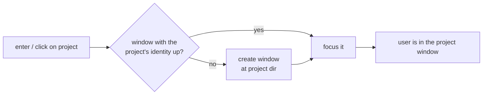

# Idea — switcher creates the project window

The switcher should take you to a project, unconditionally. Whether the
project already has a multiplexer window must not matter to the user: pick a
project, land in its window.

## Use case: jump to a project that has no window yet

- **Actor**: a cmdman user with several compose projects, working inside the
  multiplexer with the switcher docked (or open as a widget).
- **Situation**: some projects were launched earlier and have windows; others
  are known to cmdman but have no window up right now.
- **Intent**: get to project X's window and start working there.
- **Walkthrough**: open the switcher → move to project X → press enter (or
  click). If X already has a window, focus jumps straight to it. If it has
  none, a window for X is created at X's directory and focus jumps into the
  fresh window. Either way the user ends up in X's window with X's bells
  marked read. Success is silent — landing in the window *is* the feedback.

## Usability requirements

- One gesture, one outcome: selection always lands in the project's window;
  no "no window is up for it" dead end for a project cmdman can address.
- Selecting the project whose window is already focused is a harmless no-op
  jump, never a duplicate window.
- A project cmdman cannot address a window by — no known directory or name —
  is reported on the hint line instead of failing loudly.
- Selection does not start or stop anything: creating the window must not
  bring the project up. Starting commands stays in the dashboard/launcher.
