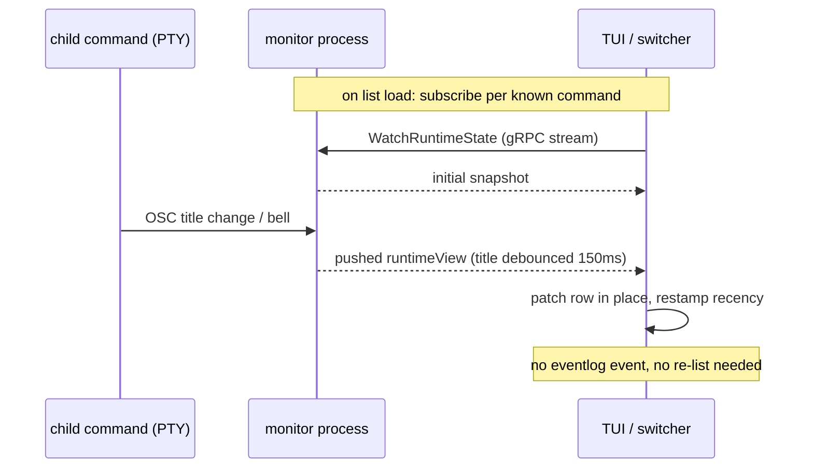

# Idea: TUI widgets update immediately from monitor runtime state

The TUI — the root dashboard and the switcher — should reflect a command's live runtime state (title, reported status,
detail, bell) the moment it changes, without waiting for an unrelated
lifecycle event to trigger a re-list.

This is not a fresh idea: it is the deferred consumer half of the
quicklaunch plan's **D32**
([../2026-07-26-01-quicklaunch_frame_monitor_state/DECISION.md](../2026-07-26-01-quicklaunch_frame_monitor_state/DECISION.md)),
quoted verbatim:

> "Track C's runtime state (title, reported status, bell-unread) is held
> in-memory in the monitor... served over the monitor's gRPC as a
> server-streaming RPC (subscribe → initial snapshot + push on change),
> alongside an extended one-shot Status. **Consumers: the
> TUI/switcher/launcher subscribe to streams**; `ls`/`ps` gain a bounded
> parallel one-shot dial across commands with a SocketPath (short
> timeout) to fill their columns."

The producer half (`WatchRuntimeState`, the server-streaming RPC) shipped;
no client anywhere dials it. The TUI instead re-fetches every command's
state via the one-shot `Status` fan-out, and only when an eventlog
lifecycle event (`starting`/`running`/`exited`/`failed`) happens to fire.
Title, status, and bell changes alone are invisible until then.

## Use cases

### 1. Shell retitles — switcher row follows

A user works in a supervised shell whose prompt retitles the terminal
(`\e]0;...\a`) on every directory change. The docked switcher is visible
beside it.

- The user `cd`s; the shell emits a new title.
- The switcher row for that command shows the new title within roughly
  the monitor's title debounce (150ms) — no lifecycle event, no manual
  refresh, no switching windows to force a reload.
- The switcher's recency bucketing (D20) reorders on the *actual* title
  change time, not on whenever a re-list happened to observe it.

### 2. Bell in a background command — badge appears now

A long build in a non-focused window rings the terminal bell when it
finishes a stage.

- The bell lands in the monitor's runtime state immediately (bell/status
  changes are not debounced server-side).
- The switcher and root TUI show the bell-unread badge on that row at
  once, so the user notices without touching anything.

### 3. Reported status flips — dashboard row updates live

A command (or a hook) sets reported status working → waiting via
`SetReportedStatus`.

- The root TUI Commands tab row and the switcher row flip their status
  marker immediately.

### 4. Command appears / disappears — unchanged experience

A command starts or exits. The eventlog lifecycle path continues to
drive list membership exactly as today: debounced re-list, rows appear
and vanish. Live streams attach to newly listed commands and drop with
vanished ones; the user sees no behavioral difference for lifecycle
itself, only that the rows are live *between* lifecycle events.

## Usability requirements

- **No new gestures.** Liveness is ambient; no keybind, flag, or config
  key is added for it. The Compose tab's manual `r` refresh may stay for
  structural re-list but must not be *required* to see title changes.
- **Feedback latency**: bounded by the monitor's existing server-side
  debounce (150ms for title-only churn; immediate for bell/status). No
  additional client-side polling interval.
- **Failure experience**: a monitor whose stream cannot be dialed (dead
  socket, mid-exit) degrades to exactly today's behavior — the row shows
  the last known state until the lifecycle re-list removes or corrects
  it. Stream failure is silent at the row level, logged, never an error
  popup.
- **No churn amplification**: a retitle-happy shell must not cause
  visible flicker or reorder storms; the server-side debounce plus
  patch-in-place rendering covers this.

### Non-case: the launcher (L1)

The launcher is deliberately **not** part of this idea. It is a
transient widget — opened when needed, closed immediately after the
needed projects are started — so a listing that is current at open is
the right experience; nothing on screen lives long enough for liveness
to matter. Its one-shot listing and its command/project state marker
behavior stay exactly as designed
(`cmdman/tui/widget/launcher/launcher.go:193-195`).
