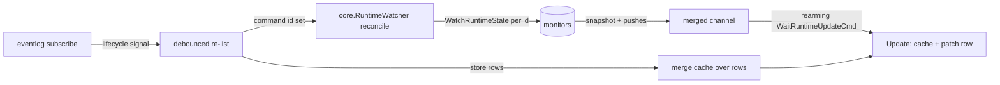

# Plan: TUI live runtime state — widgets subscribe to WatchRuntimeState

Deliver the unbuilt consumer half of the quicklaunch plan's D32: the
root TUI and the switcher subscribe to monitor state so title / reported
status / detail / bell changes render immediately, instead of waiting
for an eventlog lifecycle event to trigger a re-list. The launcher is
out of scope (L1: a transient widget needs no liveness).

Status: **finalized 2026-08-16 — idea gate passed, all open questions
resolved (DECISION.md L1–L4), traceability gate passed.** Standalone
plan (like
[../2026-08-12-01-frame_verbs/](../2026-08-12-01-frame_verbs/PLAN.md), it
delivers a piece of the pre-sub-plan-era quicklaunch parent without
restructuring it).

## Inherited decisions (quoted, not summarized)

From
[../2026-07-26-01-quicklaunch_frame_monitor_state/DECISION.md](../2026-07-26-01-quicklaunch_frame_monitor_state/DECISION.md):

- **D32**: "Track C's runtime state (title, reported status, bell-unread)
  is held in-memory in the monitor... served over the monitor's gRPC as a
  server-streaming RPC (subscribe → initial snapshot + push on change),
  alongside an extended one-shot Status. **Consumers: the
  TUI/switcher/launcher subscribe to streams**; `ls`/`ps` gain a bounded
  parallel one-shot dial across commands with a SocketPath (short
  timeout) to fill their columns."
  - Deviation: D32's "launcher" in that consumer list is **not**
    delivered — the user withdrew it here (L1: the launcher is
    transient; liveness is worthless to it). Recorded as this plan's
    L1, not by editing the parent.
- **D35**: title capture is TTY-only; piped commands never produce a
  title. (Bounds what "live title" can show.)
- **D20** (bucket sort) and **D22** (selecting a project reads its
  bells) are unchanged consumer semantics this plan feeds with live data.

## Goal / success criteria

1. With the switcher (docked or standalone) and the root TUI open, a
   title change in a supervised TTY command is visible in the row within
   the monitor's 150ms title debounce plus render, with **no** eventlog
   lifecycle event occurring.
2. Bell-unread and reported-status changes appear immediately (no
   server-side debounce applies to them); the switcher's bell-read
   suppression (D22) still holds across pushes.
3. Switcher recency bucketing (D20) stamps on push arrival (L4),
   replacing the load-time-observed approximation its own comment flags
   (`cmdman/tui/widget/switcher/switcher.go:441-446`).
4. Lifecycle behavior (rows appearing/disappearing) is unchanged: the
   eventlog re-list path remains the discovery mechanism (L2).
5. A dead/undialable monitor degrades to today's behavior (stale row
   until re-list), never an error popup.
6. The launcher is untouched: its one-shot listing, its command/project
   state marker behavior, and its dormant bell glyph stay exactly as
   they are (L1).

## Scope

- `cmdman/`: `Service.WatchRuntimeState` streaming client (new file
  `cmdman/cmdman_runtime_state_watch.go`).
- `cmdman/cli/tui_backend_commands.go`: backend `WatchRuntimeState`
  implementation; drop the one-shot `RuntimeStates` fan-out from
  `ListCommands` (L3).
- `cmdman/tui/internal/core/`: `Backend` interface addition, stream
  types, and the `RuntimeWatcher` subscription manager + messages.
- `cmdman/tui/alias.go`: re-export the new contract types.
- `cmdman/tui/` root model and `cmdman/tui/widget/switcher`.
- `cmdman/tui/internal/coretest`: fake-backend support for the stream.
- Tests: unit beside code; service-level integration test against a real
  spawned monitor; e2e in `e2e/cmdman`.
- `doc/man` tui page wording where refresh behavior is described.

## Non-goals

- Replacing the eventlog subscription (`core.SubscribeCmd` /
  `EventSignalMsg`) — it remains the discovery mechanism for commands
  appearing/disappearing (L2).
- `ls` / `ps` columns: they keep the bounded one-shot `RuntimeStates`
  fan-out, exactly as D32 assigned them; `Service.RuntimeStates` itself
  is untouched.
- Compose scale badges (`ScaleIndex`/`ScaleCount`), window naming, and
  mux identity — stamped/static at create time, not runtime state.
- Monitor-side changes: `WatchRuntimeState`, its 150ms title debounce,
  and stream lifetime semantics ship as-is. The debounce stays for the
  same reason `rawRefreshInterval` throttles preview repaints
  (`cmdman/tui/runtime.go:21-25`): titles originate in the vt trap and
  can change at output rate, each push costs a gRPC send per subscriber
  plus a serial Update → rebuild → repaint on the client, and an
  unthrottled high-rate source starves keypresses. Debouncing once at
  the server is cheaper than a throttle in every client, and 150ms is
  below what reads as anything but immediate.
- The launcher (L1): a transient widget opened when needed and closed
  right after starting projects — its one-shot listing and its
  command/project state marker (including the dormant bell glyph at
  `cmdman/tui/widget/launcher/view.go:45-47`) stay as they are.
- New keybinds, flags, or config keys — liveness is ambient (IDEA.md).

## Context

- Producer surface: `cmdman/monitor/mon_server.go:300-318`
  (`WatchRuntimeState`), `cmdman/monitor/runtime_stream.go:22-91`
  (`streamRuntimeState`, `defaultTitleDebounce` = 150ms). Snapshot then
  push; title-only changes debounced, bell/status flush immediately.
  The stream ends only when the monitor leaves an active state — it
  survives restart-policy restarts within one monitor process, and each
  run's `runtimeState.reset()` is itself a pushed (clearing) change.
- No client dials it anywhere today. The deferral is recorded at
  `cmdman/cli/tui_backend_commands.go:26`.
- Current TUI flow: eventlog subscribe → debounced re-list
  (`cmdman/tui/runtime.go:36-68`; switcher mirror
  `cmdman/tui/widget/switcher/switcher.go:137-153`); each re-list runs
  the one-shot `RuntimeStates` fan-out
  (`cmdman/cli/tui_backend_commands.go:36`, shared 1s budget).
- Client-side dial/proto plumbing to reuse: `Service.runtimeState`
  (`cmdman/cmdman_runtime_state.go:102-125`) — `connectMonitor` +
  `runtimeStateFromProto`; channel-subscription shape to copy:
  `cmdman.EventsSubscription` as consumed by `eventStream`
  (`cmdman/cli/tui_backend_commands.go:141-161`).
- Bubbletea rearming-receive precedent: `core.WaitEventCmd`
  (`cmdman/tui/internal/core/events.go:36-44`).
- Row data: `core.CommandRow.Title/Status/Detail/Bell`
  (`cmdman/tui/internal/core/state.go:28-34`), filled from
  `CommandInfo` in `GroupFromInfos`; renderers gate on `LiveReport`
  (`state.go:76-78`), which already keeps a dead command's stale report
  off screen.
- Launcher (out of scope, L1): one-shot listing at open by design
  (`cmdman/tui/widget/launcher/launcher.go:193-202`); noted here only
  so nobody "helpfully" wires it up — the exclusion is deliberate.

## Approach

Layer streams on the eventlog (L2). The re-list remains the source of
*which* commands exist; a `core.RuntimeWatcher` reconciles per-command
`WatchRuntimeState` streams against each loaded list. Pushed views
funnel through one merged channel into a single rearming `tea.Cmd`
(mirroring `WaitEventCmd`), and `Update` patches the matching row.

The model — root and switcher alike — keeps a **runtime-state cache**
keyed by command id, fed only by pushes (each stream opens with a
snapshot, so the cache fills as soon as subscriptions land). List loads
stop carrying runtime state at all (L3): `GroupFromInfos` merges the
cache over the store-derived rows, so a re-list never flashes rows back
to empty titles while snapshots re-arrive.

Stream lifecycle: subscribe when a listed command is in a state with a
live monitor (`starting`/`running`) and not yet held; close and drop
when it vanishes from the list or leaves those states; when a stream
ends on its own (monitor exited), drop it and redial only when a later
reconcile still lists the command as live — never busy-redial a dead
socket. A failed subscribe is silent (criterion 5): the row keeps the
cached state until the lifecycle re-list corrects it.



Rejected alternatives:

- One rearming `tea.Cmd` per stream (N blocked goroutines returning
  per-id messages): works, but the merged channel keeps the bubbletea
  side to a single message source and puts stream bookkeeping in one
  testable type instead of scattering it across Update arms.
- A backend-side aggregate (`WatchRuntimeStates(ids)`) hiding the
  reconcile below the `Backend` interface: keeps core simpler but makes
  the fake-backend story worse and buries the reconcile policy in the
  cli layer, where the model can't unit-test it.

## Public surface delta

Authoritative; anything user-visible not listed here is out of scope.
No CLI flags, config keys, or persistent formats change.

```go
// cmdman — new file cmdman/cmdman_runtime_state_watch.go
// Naming follows the sibling EventsSubscription/Records() pair — and
// deliberately does NOT reuse the tui-side name RuntimeStateUpdate:
// cli/tui_backend_commands.go imports both packages, and two
// same-named, differently-shaped types in one file invite mixups.

// RuntimeStateRecord is one pushed runtime-state view from a watched
// monitor, or the stream's terminal read error.
type RuntimeStateRecord struct {
    State RuntimeState // existing type: Title / Status / Detail / BellUnread
    Err   error
}

// RuntimeStateSubscription delivers runtime-state records (initial
// snapshot, then push on change) until closed. Records' channel closes
// when the monitor leaves an active state or Close is called.
type RuntimeStateSubscription struct{ /* unexported fields */ }

func (s *RuntimeStateSubscription) Records() <-chan RuntimeStateRecord
func (s *RuntimeStateSubscription) Close() error

// WatchRuntimeState dials the command's monitor and subscribes to its
// runtime-state stream.
func (s *Service) WatchRuntimeState(
    ctx context.Context, idOrName string,
) (*RuntimeStateSubscription, error)
```

```go
// cmdman/tui/internal/core/backend.go — Backend interface addition
// (re-exported from cmdman/tui via alias.go like every contract type)

type Backend interface {
    // ...existing methods unchanged...

    // WatchRuntimeState subscribes to one command's monitor runtime-state
    // stream: an initial snapshot, then a push per change. The stream
    // closes when the monitor leaves an active state.
    WatchRuntimeState(ctx context.Context, id string) (RuntimeStateStream, error)
}

// RuntimeStateView is the pushed runtime state, mirroring the
// Title/Status/Detail/BellUnread fields on CommandInfo.
type RuntimeStateView struct {
    Title      string
    Status     string
    Detail     string
    BellUnread bool
}

// RuntimeStateUpdate is one stream message; a non-nil Err is a terminal
// read error (the channel closes after it).
type RuntimeStateUpdate struct {
    State RuntimeStateView
    Err   error
}

// RuntimeStateStream delivers runtime-state updates until closed.
type RuntimeStateStream interface {
    Updates() <-chan RuntimeStateUpdate
    Close() error
}
```

```go
// cmdman/tui/alias.go additions
type (
    RuntimeStateView   = core.RuntimeStateView
    RuntimeStateUpdate = core.RuntimeStateUpdate
    RuntimeStateStream = core.RuntimeStateStream
)
```

Removed from the TUI path (L3): the `RuntimeStates(...)` call inside
`serviceBackend.ListCommands` (`cmdman/cli/tui_backend_commands.go:36`)
and its "later phase" doc comment. `Service.RuntimeStates` itself stays,
serving `ls` / compose `ps` / `status` unchanged.

Internal (pinned for layout, not exported): `core.RuntimeWatcher`,
`core.RuntimeUpdateMsg`, `core.WaitRuntimeUpdateCmd` in a new
`cmdman/tui/internal/core/runtime_watch.go`.

## Implementation steps

1. **Service streaming client.** Add
   `cmdman/cmdman_runtime_state_watch.go`: `Service.WatchRuntimeState`
   resolves the id (`store.ResolveID` path as used by other verbs),
   reads `SocketPath` from state, reuses `connectMonitor` +
   `runtimeStateFromProto`, opens the gRPC `WatchRuntimeState` stream,
   and pumps `Recv` into a buffered channel following the
   `EventsSubscription` shape. Clean end (EOF / monitor inactive) closes
   the channel; any other error delivers one `Err` update then closes.
   Verify: integration test beside `cmdman_runtime_state_test.go`
   against a real spawned monitor — snapshot on subscribe, debounced
   title push, immediate bell push, channel close on stop.
2. **Backend contract.** Add the interface method and the three types to
   `core/backend.go`; re-export in `tui/alias.go`; implement
   `serviceBackend.WatchRuntimeState` in
   `cmdman/cli/tui_backend_commands.go` wrapping step 1 (pump pattern of
   `eventStream`); extend the `coretest` fake backend with a
   test-controllable fake stream. Verify: build + a backend pump test.
3. **`core.RuntimeWatcher`.** New `core/runtime_watch.go`: manager
   holding per-id streams and one merged channel.
   `Reconcile(ctx, backend, infos)` subscribes listed commands in
   `starting`/`running` not yet held and closes/drops vanished or
   stopped ones; per-stream pump goroutines tag updates with the id;
   `WaitRuntimeUpdateCmd(w)` is the single rearming receive returning
   `RuntimeUpdateMsg{ID, State, Err, Closed}`; a stream that ends is
   dropped and redialed only by a later Reconcile that still lists the
   command live. `Close()` tears everything down on TUI exit. Verify:
   unit tests with coretest fakes — subscribe-new / drop-vanished /
   redial-after-relist / no-busy-redial / failed-subscribe-silent
   (retried only by a later reconcile; criterion 5) / merged ordering.
4. **Root TUI wiring.** Model gains the watcher and a
   `runtime map[string]core.RuntimeStateView` cache;
   `onCommandsLoaded` reconciles the watcher, evicts cache entries for
   ids the reconcile dropped, and merges the cache over the freshly
   grouped rows; a new `Update` arm for
   `core.RuntimeUpdateMsg` updates the cache, patches the matching
   `m.commands.groups` row in place, and rearms the wait. Drop the
   `RuntimeStates` fan-out + comment from
   `serviceBackend.ListCommands` (L3). Verify: model tests — push
   patches a row without a re-list; re-list keeps cached titles (no
   flash); `LiveReport` gating unchanged for exited commands.
5. **Switcher wiring.** Same watcher + cache in the switcher model. On
   `RuntimeUpdateMsg`: update the cache, restamp `m.titles[id]` at push
   arrival when the title changed (L4 — replacing load-time stamping in
   `stampTitles`), then `rebuild()` so `bucketSort` (D20) and
   `applyBellRead` (D22) run against the pushed state. Verify: switcher
   tests with the fake clock — a pushed retitle moves the command's
   bucket; a bell push on a read bell stays suppressed until the
   monitor clears and re-rings.
6. **Docs + comment hygiene.** Update the `doc/man` tui page where
   refresh behavior is described (rows update live); the stale "later
   phase" comment falls with step 4. Keep STATUS.md/DECISION.md
   current.
7. **e2e.** In `e2e/cmdman` (scripted-tmux precedent from the frame
   plans): a TTY command retitles with **no** lifecycle event; assert
   the switcher/TUI shows the new title. Cover criterion 1 verbatim.

## Testing and verification

- Unit: watcher reconcile matrix (step 3), model patch/no-flash (step
  4), switcher restamp + bell suppression (step 5).
- Integration: `Service.WatchRuntimeState` against a real monitor
  (step 1).
- e2e: title-change-without-lifecycle reaches the TUI (step 7).
- `go test ./...` + golangci-lint clean; run the TUI manually against a
  retitling shell for a smoke pass.

## Risks

- Stream-per-command fan-in: many commands → many held gRPC streams.
  Bounded in practice (tens); the watcher must provably not leak
  streams on reload churn (step 3 tests).
- Snapshot flash on re-list once L3 removes the fan-out — mitigated by
  the model-side cache (Approach); step 4 tests pin it.
- Push-vs-relist ordering: with L3, list loads carry no runtime state,
  so there is no second writer to race the cache.

## Open questions

None — all resolved; see DECISION.md L1–L4.
