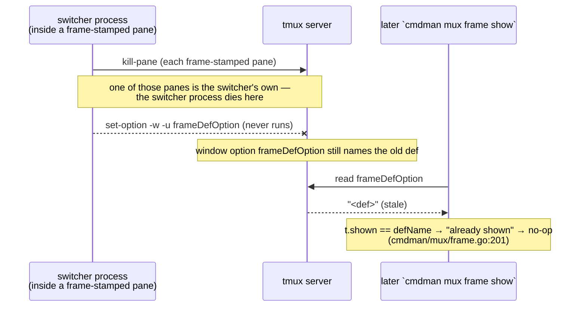

# PLAN — improve TUI widget behavior

Five behavior changes across the launcher / switcher / project-manager
widgets: config-known projects listed without history, mux/compose down
actions in all three widgets, strict window-per-project launching, removal
of the switcher's `z` hide-frame gesture, and layout-stable bring-up (a
widget bring-up never cycles the mux layout).

## Goal / success criteria

1. Launcher default view (empty filter) lists projects discovered from the
   compose config dir (`compose.ListNamedProjects()`), with no history row
   required. Success: fresh `data_dir`, one named project under
   `<config dir>/cmdman/compose/` → launcher shows it on open.
2. Launcher, switcher, and project manager each offer **mux down** (dashboard
   teardown, commands keep running) and **compose down** (stop + remove
   commands, confirmed). Success: each gesture reaches
   `compose.Service.MuxDown` / `compose.Service.Down` and reports its outcome
   in the widget.
3. Launching two distinct projects from the launcher always produces two
   distinct windows, including same-name-different-workdir pairs and unnamed
   projects. Success: window lookup keys on project identity, not on the bare
   `"cmdman-<project>"` name.
4. `z` no longer exists in the switcher; all plumbing whose only caller was
   `z` is gone; docs match. `cmdman mux frame show|hide` (CLI) is untouched.
5. A bring-up from a widget never cycles the mux layout: a fresh window gets
   layout 0, an existing window keeps the layout it shows. Success: launch A,
   start B, re-start A — A's window still shows the layout it had; B's fresh
   window shows layout 0. Cycling remains only an explicit gesture.

## Non-goals

- No change to the CLI verb surface (`compose down`, `compose mux down`,
  `mux down`, `mux frame *` all keep their behavior). In particular, repeated
  `cmdman mux up` / `cmdman compose mux up` with no `--layout` **keeps
  cycling** — item 5 changes only what the widgets request, not the CLI's
  cycle semantics.
- No new frame components or frame-spec changes.
- No zellij work; tmux remains the only muxctl driver exercised.
- Store-derived projects (`compose.Service.ListProjects`) and the cwd project
  stay filter-only in the launcher (per D2 — widening beyond config is
  explicitly out unless the user asks).

## Context (current behavior)

### Launcher listing

`serviceBackend.ListLaunchTargets` (`cmdman/cli/tui_backend_launcher.go:37-75`)
already merges four sources: compose history (SQLite, `fromHistory=true`),
store-derived projects, **named config projects**
(`compose.ListNamedProjects()` over `cmdman.ComposeConfigDir()`,
`cmdman/compose/discover.go:142-187`), and the cwd project — the last three
all `fromHistory=false`. The launcher's `matched()`
(`cmdman/tui/widget/launcher/launcher.go:738-753`) hides everything but
`FromHistory` rows while the filter is empty, so config-known projects are
loaded but invisible until searched. Per-project `enabled` starts as
`p.FromHistory` (`launcher.go:93`) and gates what `s` mass-starts.

### Launch path and window identity

`s`/`S` → `startProjectCmd`/`launchProjectCmd` → `serviceBackend.
StartProject`/`LaunchProject` → `bringUp`
(`cmdman/cli/tui_backend_launcher.go:393-425`, `KeepCurrentWindow: true`
hard-coded) → `compose.Service.MuxUp` → `mux.Run` (`cmdman/mux/run.go:105-200`)
→ tmux driver `Server.New` → `findOrCreateWindow`
(`pkg/muxctl/tmux/tmux.go:290-313`), which finds by **exact window name**.
Window name comes from `ProjectSelection.MuxWindowName()`
(`cmdman/compose/selection.go:38-54`): `"cmdman-<project>"`, or `"cmdman"`
when the project name is empty. Identity
(`GenerateProjectIdentity(workdirHash, project)`) is per-workdir, but the
name-keyed lookup means:

- project `foo` at `/a` and project `foo` at `/b` → same window name
  `cmdman-foo` → **shared window**;
- two unnamed projects → both `"cmdman"`, identity `""` → shared window.

The identity stamp (`@cmdman` owner option) plays **no part** in this
lookup — `findWindow` compares bare `#{window_name}`
(`pkg/muxctl/tmux/tmux.go:277-282`) and `New` stamps the identity only
*after* adoption (`tmux.go:150-157`), **overwriting the previous owner's
stamp**. A takeover therefore also orphans the prior project: its
identity-keyed operations (`mux.Land`, `MuxDown`, cycle-scale) can no
longer find any window of theirs.

Name-keyed lookup is wrong per se, not merely inconsistent (D4 amendment):
nothing in the `muxctl` contract promises window-name uniqueness —
`muxctl.Window.WindowName` explicitly warns it "may differ from Identity" —
and names are mutable by nature (user rename, in-pane programs setting
titles via OSC 2, tmux `automatic-rename`). So find-by-name has **both**
failure modes: false positive (adopt a foreign window — the reported bug)
and false negative (cmdman's own window was renamed → lookup misses →
duplicate window). The correct split already exists elsewhere in the
codebase: `mux.Land` (`cmdman/mux/land.go:101-127`) and `mux.Down`
(`cmdman/mux/down.go:111-139`) do the cmdman-side find via
`Server.ListWindows` filtered by identity, then act on the `WindowID`.
`mux.Run` is the outlier that delegates lookup to the driver's `New` — and
even `Land`'s create-on-miss branch is exposed, because `New`'s create path
adopts by name before creating. Step 7 removes name adoption from the
driver and moves find-or-create orchestration to `cmdman/mux`.

`mux.Land` (`cmdman/mux/land.go`, used by switcher `enter` and launcher `S`
focus step) already finds windows **by identity** — the up path is the odd
one out. Prior plan `doc/plan/2026-08-15-01-switcher_creates_window` (done)
established identity-keyed landing; its HANDOFF left two open items, one of
which — identity-less projects dead-end — overlaps item 3 here; D4 decides
this plan absorbs it (step 7). The other item (windows on a dedicated mux
socket invisible to autodetect-only `Land`) stays with that plan's HANDOFF.

### Layout cycling on bring-up (item 5, user-reported bug)

`mux.Run` treats an empty `RunOptions.Layout` as "cycle": on an existing
window it reads the persisted marker and applies `(marker+1) %
len(spec.Layouts)`; only a fresh window starts at 0
(`cmdman/mux/run.go:148-183`, contract stated at `run.go:50-54` and
`cmdman/compose/mux.go:31`). The launcher's `bringUp` builds
`compose.MuxUpOption` without setting `Layout`
(`cmdman/cli/tui_backend_launcher.go:414-421`), so any widget bring-up that
lands on an **existing** window advances its layout.

Reported repro: launch project A (dashboard up, marker 0) → start project B
→ B's `MuxUp` resolves to the *same* window (the item-3 name collision), sees
marker 0, applies layout index 1 (the user's second layout,
"claude-focused"), and rebuilds the window for B. Two compounding defects:
the takeover is item 3; the cycle-on-re-up is item 5 and survives the item-3
fix (a same-project re-up — `s` after a command's config changed — would
still cycle its own window's layout).

### Down operations

`compose.Service.Down` (`cmdman/compose/service_down.go:45-122`; stop +
remove, CLI: `cmd/cmdman/commands/compose_down.go`) and
`compose.Service.MuxDown` (`cmdman/compose/mux.go:153-184`; dashboard-only,
requires `selection.Spec.Mux != nil`, CLI:
`cmd/cmdman/commands/compose_mux_down.go`) exist and are CLI-only today —
nothing under `cmdman/tui` or `cmdman/cli/tui_backend*.go` references either.
All widget actions funnel through the `core.Backend` interface
(`cmdman/tui/internal/core/backend.go:155-316`); the wiring template is
`CycleMux`/`SetScale` (`cmdman/cli/tui_backend_mux.go:28-41`) plus the
widget-side `tea.Cmd` wrappers
(`cmdman/tui/widget/projectmanager/commands.go:100-108`).

### The `z` desync

`z` (`cmdman/tui/widget/switcher/switcher.go:371-372`) and
`cmdman mux frame hide` call the **same** `mux.FrameHide`. The desync is a
self-kill race, not a divergent path:



`Session.HideFrame` (`pkg/muxctl/tmux/frame.go:265-309`) kills panes
(298-302) **before** clearing the persisted `frameDefOption` state (303-307);
the switcher's pane is frame-stamped (`stampFramePane`, 437-444), so the
caller dies mid-call. Reordering (clear state first) alone is **not** a safe
fix: `frameTarget.hide` no-ops when the state key is empty
(`cmdman/mux/frame.go:241-243`), so a crash after clear-before-kill would
leave live frame panes the CLI can no longer remove. Removing `z` eliminates
the only in-pane caller, and per D5 this plan also hardens `hide` to be
state-independent (step 2), so panes and state can never desync again.

## Approach

| Item | Chosen approach | Rejected |
| --- | --- | --- |
| 1 | Thread a `FromConfig` flag from the accumulator through `core.LaunchLocation`/`LaunchProject`; `matched()` admits `FromHistory \|\| FromConfig` on empty filter; `enabled` default stays history-only (D2) | Overload `FromHistory=true` for config rows (lies about provenance, breaks `ctrl+d` forget semantics) |
| 2 | Two new `core.Backend` methods (`MuxDown`, `ComposeDown`) shared by all three widgets; per-widget keybinds `d`/`D` with confirm on `D` (D3) | Per-widget bespoke backends; shelling out to the CLI; `x`/`X` keys; no-confirm compose down |
| 3 | Driver `New` always *creates* (name is display-only, never a lookup key); find-or-create moves cmdman-side: `mux.Run` does `ListWindows` by identity → reuse `WindowID` or create, exactly as `Land`/`Down` already do; unnamed projects get a synthesized workdir-hash identity (D4, amended 2026-08-18) | Identity-first lookup *inside* the driver's `findOrCreateWindow` (original D4 — wrong layer: lookup is the cmdman-side job, and the driver keeps a name-matching code path); workdir-hash-suffixed window names (names stay a key, which the contract never promised unique) |
| 4 | Delete `z` and all single-caller plumbing behind it; docs updated; harden `hide` to be state-independent so the desync cannot recur (D5) | Keeping `z` and only reordering `HideFrame` (unsafe — see Context); keeping `z` and double-forking the hide (complexity for a gesture the CLI already covers); HANDOFF-note-only (user chose hardening) |
| 5 | Add a "keep" layout mode to `mux.Run` (existing window re-applies its own marker, fresh window gets 0); widget bring-up requests it via `MuxUpOption` (D6) | Widgets pass `Layout: "0"` (snaps a user-chosen layout back to 0 on every re-up); changing empty-`Layout` semantics globally (breaks the CLI's documented cycle gesture) |

**Item 3 blast radius (explicit):** changing `findOrCreateWindow` to key on
identity changes window-reuse semantics for **every** `mux up` caller — CLI
`cmdman mux`, `cmdman compose mux up`, the launcher — not just the launcher.
That is intended (it fixes the same-name collision for the CLI too) and must
be covered by driver-level tests, but reviewers should read item 3 as a
muxctl/mux change, not a launcher-scoped one.

## Public surface delta

No CLI flag/verb changes. The user-visible surface is widget keybinds, help
text, and the internal-but-contractual `core.Backend` interface.

```go
// cmdman/tui/internal/core/backend.go — Backend interface delta
type Backend interface {
	// ... unchanged methods elided ...

	// REMOVED (item 4; only caller was the switcher's z):
	// HideFrame(ctx context.Context) error

	// ADDED (item 2):

	// MuxDown tears down the project's mux dashboard windows; the supervised
	// commands keep running. A project whose spec has no mux: section comes
	// back as an error the widget shows in its status line.
	MuxDown(ctx context.Context, projectName, composeFile, workDir string) error

	// ComposeDown stops and removes the project's supervised commands and
	// reports what it did. Destructive; widgets gate it behind a confirm.
	ComposeDown(ctx context.Context, projectName, composeFile, workDir string) (DownSummary, error)
}

// ADDED — cmdman/tui/internal/core/backend.go (or launch.go)
// DownSummary is what ComposeDown reports for the status line.
type DownSummary struct {
	Stopped int
	Removed int
}

// CHANGED — cmdman/mux/run.go (item 5)
type RunOptions struct {
	// ... existing fields ...
	// Layout selects a specific layout ("name" or 0-based index). Empty
	// defers to KeepLayout; with KeepLayout also false, empty cycles to the
	// next layout (the CLI's repeated-`mux up` gesture, unchanged).
	Layout string
	// KeepLayout is ADDED: an existing window re-applies the layout its
	// marker records instead of advancing; a fresh window gets layout 0.
	// Ignored when Layout is set. Widget bring-ups set it.
	KeepLayout bool
}

// CHANGED — cmdman/compose/mux.go (item 5)
type MuxUpOption struct {
	// ... existing fields ...
	KeepLayout bool // ADDED: forwarded to mux.RunOptions.KeepLayout
}

// CHANGED — cmdman/tui/internal/core/launch.go (item 1)
type LaunchLocation struct {
	// ... existing fields ...
	FromHistory bool
	FromConfig  bool // ADDED: at least one project here came from the compose config dir
}

type LaunchProject struct {
	// ... existing fields ...
	FromHistory bool
	FromConfig  bool // ADDED: discovered via compose.ListNamedProjects()
}
```

Keybind delta (identical meaning in all three widgets; keys settled by D3):

```text
switcher:        REMOVED  z  (hide frame)
                 ADDED    d  (mux down: dashboard only)          [D3]
                 ADDED    D  (compose down: stop+remove, confirm) [D3]
launcher (list): ADDED    d / D  (same meanings)                  [D3]
projectmanager:  ADDED    d / D  (same meanings)                  [D3]
```

Documentation surfaces touched:

```text
cmd/cmdman/commands/tui_widget_switcher.go   Long help: drop z, add d/D
cmd/cmdman/commands/tui_widget_launcher.go   Long help: add d/D
cmd/cmdman/commands/tui_widget_projectmanager.go  Long help: add d/D
doc/man/cmdman-tui.1.md:52-84                widget key tables: drop z, add d/D
doc/man/cmdman-mux.1.md:241-247              REMOVE section "Collapsing from the docked switcher"
```

Behavior-only contract changes (no signature change, `pkg/` exported
surface — D4/D5):

- `pkg/muxctl` `Server.New` without `WindowID` always creates a window —
  the by-name find-or-create adoption is removed; `Config.WindowName` /
  `Window.WindowName` are documented display-only, never a lookup key
  (D4 as amended). Window lookup is `ListWindows` by identity, done by the
  caller (`cmdman/mux`).
- `mux.FrameHide` / tmux `Session.HideFrame`: hiding removes frame-stamped
  panes even when the persisted `frameDefOption` state key is empty or
  stale (D5) — hide is idempotent on desynced windows.

## Implementation steps

Each step is independently verifiable; order minimizes rebase friction
(interface changes first, widgets after).

1. **Remove `z` and its plumbing (item 4).**
   Delete: `case "z"` (`cmdman/tui/widget/switcher/switcher.go:371-372`) and
   the `core.FrameHiddenMsg` branch (`switcher.go:196-200`); hint text in
   `switcherFooter` (`cmdman/tui/widget/switcher/view.go:109`);
   `TestSwitcherCollapse` (`switcher_test.go:1104-1128`);
   `core.HideFrameCmd`/`FrameHiddenMsg`
   (`cmdman/tui/internal/core/commands.go:36-39,74-92`); `Backend.HideFrame`
   (`core/backend.go:265-268`); `serviceBackend.HideFrame`
   (`cmdman/cli/tui_backend_mux.go:72-80`); `FakeBackend.HideFrame` + its
   `Hidden`/`HideErr` fields (`cmdman/tui/internal/coretest/coretest.go:258-261`).
   Keep `mux.FrameHide` and everything below it (CLI still uses it).
   Update docs: `tui_widget_switcher.go` Long, `doc/man/cmdman-tui.1.md`,
   remove `doc/man/cmdman-mux.1.md` §"Collapsing from the docked switcher".
   Verify: `go build ./... && go test ./...`,
   `grep -r HideFrame cmdman/tui cmdman/cli` returns nothing.

2. **Harden frame hide against the kill/clear desync (item 4, D5).**
   Make `hide` state-independent so panes and state can never desync
   regardless of where the caller dies: `frameTarget.hide`
   (`cmdman/mux/frame.go:240-260`) no longer no-ops on an empty state key —
   it still opens the window and removes any frame-stamped panes (the
   def-specific managed-entry handling in `hideFrameOf` runs only when the
   def name is known; unstamped-def panes are killed by their frame stamp
   alone via the driver's `Session.HideFrame`,
   `pkg/muxctl/tmux/frame.go:265-309`). With `hide` no longer trusting the
   state key, `Session.HideFrame` may also clear `frameDefOption` before
   killing panes, closing the original race for any future in-pane caller.
   Verify: driver test — stamped panes present + empty/stale `frameDefOption`
   → `mux frame hide` removes them and `show` works immediately after;
   existing frame tests stay green. During implementation, read the full F7
   ordering comment at `cmdman/mux/frame.go:262-264` and confirm the
   stamp-only kill on a desynced window does not violate what F7 requires
   for managed entries (if it does, the recovery path must honor it or the
   deviation comes back to the user).

3. **Surface config provenance in the launch listing (item 1, data half).**
   Add `FromConfig` to `core.LaunchLocation`/`LaunchProject`
   (`cmdman/tui/internal/core/launch.go`), thread it through
   `launchAccumulator` (`cmdman/cli/tui_backend_launcher.go:165-217`), set it
   in the `ListNamedProjects` merge arm (`tui_backend_launcher.go:56-65`).
   Verify: backend unit test — named project in a temp compose config dir,
   no history → `ListLaunchTargets` row has `FromConfig=true`.

4. **Admit config rows on the empty filter (item 1, widget half).**
   `matched()` (`cmdman/tui/widget/launcher/launcher.go:738-753`) admits
   `l.FromHistory || l.FromConfig`; ordering: history rows first (recency),
   config-only rows after (name-sorted); per D2, config-only projects start
   **disabled** (`space` enables) so `s` never mass-starts a never-run
   project; store-derived and cwd sources stay filter-only.
   Verify: launcher widget test — config-only location visible with empty
   filter; `s` does not start its (disabled) projects until toggled.

5. **Backend down methods (item 2, backend half).**
   Add `MuxDown`/`ComposeDown` + `DownSummary` to `core.Backend`; implement
   on `serviceBackend` in `cmdman/cli/tui_backend_mux.go` following the
   `CycleMux` selection-resolution shape — `MuxDown` via
   `compose.ResolveMuxSelection`-style resolution →
   `compose.Service.MuxDown`; `ComposeDown` via `compose.LoadOrProject`-style
   resolution (no `mux:` required) → `compose.Service.Down`, mapping
   `DownResult` to `DownSummary`. Add `FakeBackend` doubles with recorded
   calls + injectable errors (`coretest.go`).
   Verify: unit tests on the fake wiring; backend test that `MuxDown` on a
   spec without `mux:` yields the sentinel error.

6. **Down keybinds in the three widgets (item 2, widget half).**
   Per widget: `tea.Cmd` wrappers (template:
   `cmdman/tui/widget/projectmanager/commands.go:100-108`), result msgs
   (e.g. `muxDownMsg`, `composeDownMsg`), key handling in `onKey`
   (`switcher.go:351-375`, `projectmanager.go:196-236`,
   `launcher.go:439-559` list zone), status-line reporting, and the confirm
   flow on compose down (per D3: pressing `D` shows
   "compose down <project>? y/n" in the status line, `y` proceeds, anything
   else cancels; `d` is immediate; `d` on a spec without `mux:` shows an
   error status line). Update footers/hints and the three cobra `Long`
   helps + `doc/man/cmdman-tui.1.md`.
   Verify: widget tests per widget — `d` calls `MuxDown` with the row's
   identity fields; `D` without confirm does nothing; `D`+confirm calls
   `ComposeDown`; error surfaces in status line.

7. **Window lookup by identity only; name becomes display-only (item 3,
   D4 as amended).**
   Two halves, driver first:
   - **Driver (`pkg/muxctl`)**: `Server.New` without `WindowID` always
     *creates* a window — delete the by-name adoption (`findWindow` call
     inside `findOrCreateWindow`, `pkg/muxctl/tmux/tmux.go:290-313`; the
     helper shrinks to plain create). Document on `muxctl.Config.WindowName`
     / `muxctl.Window.WindowName` that the name is display-only and never a
     lookup key (names are not unique: user rename, OSC 2 titles,
     `automatic-rename`). `ReuseCurrentWindow` / `WindowID` semantics are
     unchanged.
   - **cmdman side (`cmdman/mux`)**: `mux.Run` (`cmdman/mux/run.go:159-165`)
     gains the find-or-create orchestration `Land` already has
     (`cmdman/mux/land.go:101-127`): `Server.ListWindows` filtered by the
     identity → found: target that row's `WindowID` via
     `New(Config{WindowID: ...})`; miss: `New` create. `Land`'s own miss
     branch needs no change — it inherits correctness once `New` stops
     adopting by name.
   Per D4, unnamed projects get a synthesized identity (workdir hash alone)
   so identity is never empty — this absorbs the
   `2026-08-15-01-switcher_creates_window` HANDOFF item "identity-less
   projects dead-end".
   Verify: driver tests in `pkg/muxctl/tmux` — `New` with a name-matching
   pre-existing window still creates a fresh one (no adoption, no restamp);
   `mux` tests — `Run` twice with the same identity reuses the window even
   after it was renamed (false-negative case), different identities → two
   windows regardless of name equality; **no restamp takeover**: after B's
   up, A's window still carries A's identity, so A's `Land` / `MuxDown` /
   cycle-scale still find it. E2e (tmux available): launcher-equivalent
   `compose mux up` for `foo@/a` and `foo@/b` → two windows, then
   `compose mux down` at `/a` tears down only `/a`'s window.

8. **Layout-stable widget bring-up (item 5).**
   Add `KeepLayout` to `mux.RunOptions` (`cmdman/mux/run.go`): when set and
   `Layout` is empty, an existing window re-applies `stat.Marker` (clamped
   into range in case the layout list shrank) and a fresh window applies 0 —
   the `nextIdx` computation at `run.go:170-180` grows the branch. Forward it
   through `compose.MuxUpOption` (`cmdman/compose/mux.go:28-44,94-104`), and
   then enumerate the `compose.Service.MuxUp` call sites and classify each:
   **bring-up paths set it** — the launcher's `bringUp`
   (`cmdman/cli/tui_backend_launcher.go:414-421`) and any other path whose
   gesture means "make it running"; **explicit layout gestures do not** —
   `serviceBackend.CycleMux` (`cmdman/cli/tui_backend_mux.go:28-41`, the
   project manager's `c`, whose entire point is cycling) and the CLI paths
   (`mux up`, `compose mux up`), where cycling stays the documented
   behavior.
   Verify: `mux` unit test — existing window marker 1, `KeepLayout` → layout
   1 re-applied, marker stays 1; fresh window → 0; `Layout` set wins over
   `KeepLayout`. E2e with tmux: launch A, start B (after step 7, distinct
   windows), re-start A → A's layout unchanged.

9. **Docs & sweep.** Re-read all touched Long helps and man pages for truth;
   `go build ./... && go test ./...` and, where tmux is available,
   `go test ./e2e/...`. Run the repo review skills
   (`go-cmdman-review-checklist` etc. per project rules).

## Testing and verification

- Unit: launcher listing/filter tests (`launcher_test.go`), switcher &
  projectmanager keymap tests, backend tests against `FakeBackend`,
  `serviceBackend` tests with temp config dir / store.
- Driver: `pkg/muxctl/tmux` find-or-create identity tests (existing frame
  tests as the pattern).
- E2E (`e2e/cmdman`): two-projects-two-windows; `z` absence is unit-level.
- Docs: grep man pages and Long strings for `z`, stale key lists.

## Risks

- **Item 3 blast radius**: identity-keyed lookup changes reuse semantics for
  every `mux up` caller. Mitigated by driver tests + e2e; called out above.
- **Concurrent `s` bring-ups** (`startEnabled` batches one `tea.Cmd` per
  project) racing in `ensureSession`/window creation: read as safe (separate
  tmux subprocess calls, distinct names), but item 3's test should cover a
  concurrent same-session create.
- **Compose down misfire**: destructive; confirm flow is the mitigation, and
  its mechanism is pinned by D3 (status-line y/n).
- **Config-dir scanning cost** on launcher open: `ListNamedProjects` already
  runs today; item 1 only changes visibility, not IO.

## Open questions

None — Q1–Q5 resolved with the user on 2026-08-17; see DECISION.md D2–D6.
