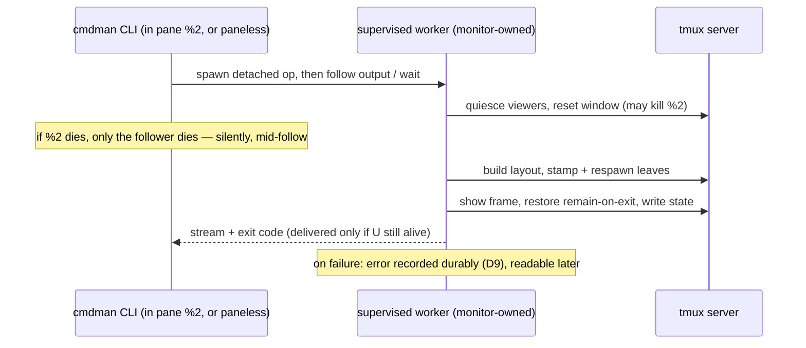

# Mux self-pane awareness — how it should be

Gate: confirmed by user, 2026-08-21 (re-run after the D8 pivot)

The mux verbs must be safe to run from any pane, including a pane inside the
very window they are about to rebuild or tear down — and from contexts with
no pane at all, such as a tmux keybinding (`run-shell`). Today,
`ApplyLayout` / `Detach` destroy the caller's own pane mid-operation, killing
the cmdman process that is driving the tmux commands: the operation dies
half-done, in silence (see RESEARCH.md for the verified mechanism, repro
matrix, and regression provenance).

The governing principle (D8): **the process that drives pane-destroying tmux
commands must never live inside a tmux pane.** The verb runs as a
cmdman-supervised operation — a detached, monitor-owned worker performs the
whole operation, exactly like the supervised shell whose invocations have
always survived. The invoking CLI process follows the worker's output and
exit while it lives; if its pane is consumed mid-operation, only the follower
dies — the operation always runs to completion. Destroying any pane, at any
point, is therefore harmless: no ordering discipline in the driver is needed.

Running a mux verb from "the wrong pane" is never a hard error: the pane is
absorbed or closed as part of the operation, exactly as the takeover has
always intended (D1).

## Use cases

### UC1 — bring the dashboard up from a plain shell inside tmux

Actor: a user in a single-pane shell window inside tmux.
Situation: commands are up (`compose -f devenv up`); no dashboard window exists.
Intent: `cmdman compose -f devenv mux up 1`.

Should: the current window is taken over (existing, intended behavior) and
becomes the dashboard — all viewers running, the `default_frame` shown around
them, layout marker recorded. The invoking shell pane is consumed by the
takeover whenever the rebuild reaches it; the supervised worker completes the
frame, marker, and restores regardless. There is never a persistent
dashboard-without-frame state. On failure the worker's error is recorded
durably (D9) and printed by the CLI if its pane still exists.

### UC2 — cycle the layout from the supervised shell shown in the dashboard

Actor: the user working in the dashboard's `shell` pane — the supervised
shell viewed through `cmdman attach`. This is the historical primary flow.
Intent: type `cmdman compose -f devenv mux up <N>` at that shell.

Should: works end to end, as it always has — and for the same reason the fix
generalizes: the operation's process tree is monitor-owned, not pane-owned.
The shell's viewer pane detaches, is rebuilt by the layout, and reconnects.

### UC3 — cycle the layout from a non-managed extra pane in the dashboard

Actor: a user who split a plain (non-supervised) pane inside the dashboard
window and runs `mux up <N>` there.

Should (D1): allowed — no hard error. The extra pane is not part of the
layout, so cycling closes it (killing the follower CLI with it); the
supervised worker completes the rebuild, leaving a clean dashboard.

### UC4 — invoke from a popup, floating pane, or tmux keybinding

Actor: a user running the verb from a tmux popup (`display-popup`), a
floating pane, or a `bind-key run-shell` binding with no visible output area.

Should: works identically everywhere. The worker never depends on the
invoking context's pane (there may be none); the completed window is
identical to an outside-window run.

### UC5 — tear down / cycle-scale from inside, including multiple windows

`mux down` from any pane of the dashboard completes the teardown and leaves
the user in the restored default shell pane. `cycle-scale` advancing the very
pane the invocation lives in completes fully.

Both verbs can act on several matching windows. The worker processes every
matching window, persists cycle-scale state for every successful target, and
records complete aggregate errors/results, regardless of when the invoking
pane died. Per D3, success output in a consumed pane is forfeit.

### UC6 — replace or hide a frame from one of that frame's panes

`mux frame hide`, `mux frame show <different-def>`, and `mux frame cycle` can
remove the frame pane containing the invoking CLI. The worker finishes both
phases of a replacement — hide the old frame, show/stamp/focus the new one —
whether or not the follower survived.

### UC7 — every currently-working flow stays unchanged

Invocations from outside tmux, from a different window, and from the launcher
widget (popup + `KeepCurrentWindow`) already work end to end — verified in
RESEARCH.md — and must keep the user-visible behavior they have today:
synchronous output and a real exit code, since the follower CLI survives the
whole operation in those contexts.

## The supervised shape, at a glance

## Usability requirements

- **The operation always completes or fails whole — never dies half-done.**
  No invocation context can abort a mux verb mid-flight; `remain-on-exit`
  restore and all cleanup always run (today they are skippable by the
  self-kill).
- **No hard errors for "wrong pane" invocations.** (D1) A non-managed pane
  inside the target window is closed/absorbed by the cycle, not rejected.
- **No new flags, no changed invocations.** The fix is behavioral; `mux up`,
  `compose mux up`, `mux down`, `cycle-scale` keep their exact CLI surface.
- **Surviving contexts keep synchronous UX.** (UC7) When the invoking CLI is
  not consumed — outside tmux, different window, popup — it prints the
  operation's output and exits with its real exit code, as today.
- **Success output on a consumed pane is forfeit.** (D3) The dashboard
  appearing IS the feedback. No extra display-message.
- **Failures are rare, durable, and recoverable — not necessarily visible in
  place.** (D6/D9) A failure is recorded in the operation's log (ephemeral,
  runtime-dir preference — D9), inspectable afterwards (`cmdman logs`-style);
  the CLI prints it only if its context survived. Restarting the operation is
  the accepted recovery; this is a developer tool.
- **Driver stays env-pure and untouched.** No self-pane logic, no settle
  contract, no ordering constraints enter `pkg/muxctl`.
