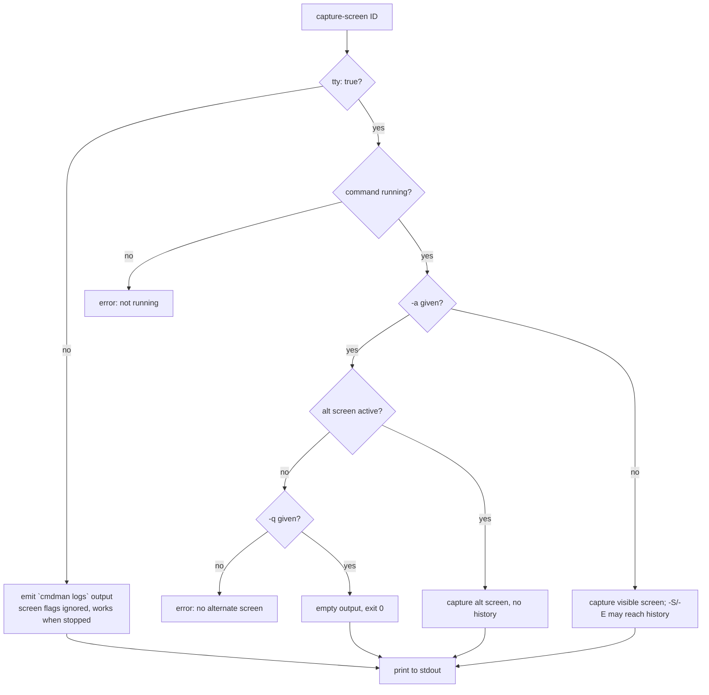

# Capture screen — how it should be

Gate: not confirmed

Take a snapshot of a supervised TTY command's current screen contents and print
it to stdout, mirroring `tmux capture-pane`. cmdman has no paste-buffer concept,
so output always goes to stdout (as if tmux `-p` were always given).

## Use cases

### 1. Scripted inspection of a full-screen program

- **Actor**: a user (or an agent/script) driving a TUI program supervised by
  cmdman — e.g. one started with `cmdman run --tty`.
- **Situation**: the program is running detached; the user wants to know what is
  on its screen right now without attaching an interactive session.
- **Intent**: `cmdman capture-screen mytui` prints the visible screen as plain
  text; the script greps it, decides, then `cmdman send-keys` the next input.
- **Walkthrough**: invoke → CLI resolves ID/name → dials the command's monitor
  socket → monitor renders its server-side emulator screen → bytes print to
  stdout → exit 0. No attach, no terminal takeover, safe to run in a pipeline.
- This pairs with `send-keys` to make a complete "drive a TUI blindly" loop —
  the same loop people build with `tmux send-keys` + `tmux capture-pane`.

### 2. Styled snapshot for humans

- **Actor**: a user debugging rendering of a TUI command.
- **Situation**: wants to see the screen as the program drew it, colors and all,
  in their own terminal or saved to a file.
- **Intent**: `cmdman capture-screen -e mytui` includes SGR escape sequences so
  `cat`-ing the output reproduces the styled screen.

### 3. Reaching into history

- **Actor**: a user whose TTY command scrolled something off the top.
- **Situation**: the interesting output is above the visible screen, in the
  emulator's scrollback (10 000 lines by default).
- **Intent**: `cmdman capture-screen -S -100 mytui` captures the last 100
  history lines plus the visible screen; `-S -` captures from the start of
  history. `-E` bounds the end likewise.

### 4. Alternate screen

- **Actor**: script or user inspecting a program that toggles the alternate
  screen (editors, pagers).
- **Intent**: default capture shows whatever is visible (main or alt). `-a`
  explicitly requests the alternate screen and fails when the program is not
  using one — unless `-q` is also given, matching tmux.

## Decision flow

## Usability requirements

- **Naming**: `cmdman capture-screen ID|NAME` (cmdman has screens, not panes).
  No alias (user decision, D5).
- **Flags follow tmux letter-for-letter** where adopted, so tmux users carry
  their habits over: `-e`, `-a`, `-q`, `-N`, `-S`, `-E` with identical meaning
  (quoted semantics live in PLAN.md). `-p` and `-b` are intentionally absent —
  stdout is the only destination.
- **Defaults match the common case**: no flags = plain text of the visible
  screen, trailing whitespace trimmed per line, one line per screen row,
  trailing `\n` — the greppable form scripts want.
- **Non-TTY fallback** (user decision, D7): a non-TTY command has no screen,
  so `capture-screen` emits what `cmdman logs` (non-follow) would print — the
  caller always gets the command's current output, whatever its mode. Since
  logs read persisted storage, this works even when the command is stopped.
  Screen-shaped flags (`-e -a -q -N -S -E`) are accepted and ignored on this
  path (D11) so one script line works across TTY and non-TTY targets.
- **Failure experience**: every refusal says why and what to do instead —
  a stopped TTY command errors as not running, explaining the screen only
  exists while the monitor runs (D10).
- **Discoverability**: shell completion for ID|NAME limited to running
  commands, like `send-keys`.
- **Non-interference**: capturing never perturbs the command — read-only
  against the monitor's existing emulator, no PTY writes, no resize.

## Explicitly not mirrored from tmux

- `-b buffer-name` / buffer semantics — no buffer concept, per request.
- `-J` (join wrapped lines) — the emulator does not record wrap points.
- `-C` (octal-escape non-printables) — emulator cells only hold printable
  graphemes; there is nothing to escape.
- `-P` (partial pending escape sequence), `-M` (mode screen) — tmux internals
  with no cmdman counterpart.
- `-L` / `-F` / `-H` (line numbers / line flags / hyperlink extraction) —
  niche; dropped (user decision, D8).
- `-T` — subsumed: trimming trailing unused positions is the default; `-N`
  turns preservation on.
