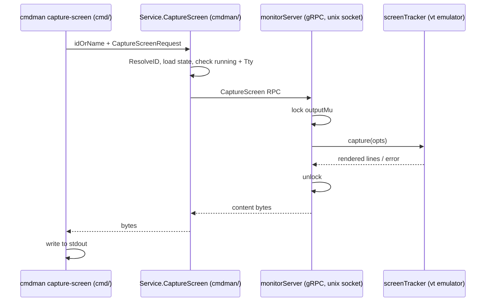

# capture-screen — implementation plan

Add `cmdman capture-screen`: print a snapshot of a TTY command's screen (tmux
`capture-pane` semantics, minus buffers — always `-p`).

## Goal / success criteria

- `cmdman capture-screen ID|NAME` prints the visible screen of a running
  `tty: true` command to stdout, without attaching or perturbing it.
- `-e`, `-a`, `-q`, `-N`, `-S`, `-E` behave as their tmux counterparts
  (quoted below).
- Non-TTY and not-running commands fail with actionable errors.
- e2e coverage drives a real TUI-ish child and asserts captured content.

## Scope

CLI subcommand, `Service.CaptureScreen`, new `CaptureScreen` RPC, monitor-side
capture rendering from the existing `screenTracker` emulator, plus
`compose capture-screen` (D6). TTY-only: non-TTY targets are rejected (D14).

## Non-goals

- tmux buffers, `-b`, `-J`, `-C`, `-P`, `-M`, `-L`, `-F`, `-H`, `-T`
  (see IDEA.md "Explicitly not mirrored").
- Any change to attach/subscribe streaming behavior.
- An `edit-screen` command (D13: capture → file → `$EDITOR` is user shell
  composition, not a cmdman feature).
- Any output for non-TTY commands (D14: rejected with a hint at
  `cmdman logs`).
- Changes to the vendored vt emulator (D12).

## Adopted tmux semantics (quoted, man tmux)

> "If -e is given, the output includes escape sequences for text and background
> attributes."
> "If -a is given, the alternate screen is used, and the history is not
> accessible. If no alternate screen exists, an error will be returned unless
> -q is given."
> "-N preserves trailing spaces at each line's end"
> "-S and -E specify the starting and ending line numbers, zero is the first
> line of the visible pane and negative numbers are lines in the history. '-'
> to -S is the start of the history and to -E the end of the visible pane. The
> default is to capture only the visible contents of the pane."

## Context (verified)

- Monitor keeps a server-side vt emulator per TTY run:
  `cmdman/monitor/terminal_screen.go` (`screenTracker`), created only when
  `m.cfg.Tty` (`mon_run.go:250`). Non-TTY commands have no screen.
- All emulator writes happen under `Monitor.outputMu`
  (`mon_run.go` `logCommandOutput` → `m.screen.feed`); `subscribeOutput`
  documents the invariant (`mon_server.go:101`). **Constraint C1: the capture
  path must hold `outputMu` while reading the emulator.**
- **Constraint C2: capture must follow the `screenTracker` healthy/recover
  pattern** — an emulator panic marks it unhealthy and capture degrades to an
  error, never crashes the monitor.
- **Constraint C3: capture is a new renderer, not `snapshot()`** —
  `snapshot()` (terminal_screen.go:58) emits a repaint (`\x1b[2J`, absolute
  cursor addressing) for attach replay; capture output must be plain
  lines (styled only under `-e`).
- Hook filtering (D40, per-attach-stream) does not apply: capture output is
  regenerated from emulator cells, not raw output bytes, so blocked sequences
  never appear in it by construction.
- vt scrollback: main screen only, default 10 000 lines
  (`internal/third_party/charmbracelet-x-vt/scrollback.go:10`), populated by
  scroll-off and `ClearWithScrollback`. Alt screen has no scrollback —
  matches tmux ("history is not accessible" under `-a`).
- Rendering primitives exist: `uv.Line.String()` (plain) and
  `uv.Line.Render()` (styled ANSI); `Scrollback.Line(i)`, `Emulator.IsAltScreen()`.
  Neither vt nor ultraviolet records per-line wrap flags (checked
  `uv.LineData`, vt `screen.go`/`buffer.go`) → `-J` infeasible without
  emulator surgery.
- **No vendored vt changes** (user decision, D12): the exported surface
  already suffices. `-a` only renders when the program is in alt mode (tmux
  errors otherwise unless `-q`), and in alt mode the alt screen *is* the
  current screen — so `Render()` / `CellAt(x, y)` on the current screen plus
  `Scrollback().Line(i)` and `IsAltScreen()` cover every capture path; the
  main-screen-under-alt case is never rendered.
- RPC pattern to copy: `WriteStdin` (unary) in
  `api/schema/proto/cmdman/v1/cmdman.proto`, server in
  `cmdman/monitor/mon_server.go`, client dial in `Service.SendKeys`
  (`cmdman/cmdman_send-keys.go:295`), CLI in
  `cmd/cmdman/commands/send-keys.go`.

## Capture flow



## Public surface delta (final)

```proto
// api/schema/proto/cmdman/v1/cmdman.proto
service CommandMonitorService {
  // Capture a snapshot of the command's terminal screen.
  rpc CaptureScreen(CaptureScreenRequest) returns (CaptureScreenResponse);
}

message CaptureScreenRequest {
  bool escapes = 1;                  // -e styled output
  bool alt_screen = 2;               // -a
  bool quiet = 3;                    // -q
  bool preserve_trailing_spaces = 4; // -N
  // Line range. 0 = first visible row; negative = history.
  // has_* distinguishes "unset" (default) and *_extreme encodes '-'.
  bool has_start = 5;
  sint32 start_line = 6;
  bool start_extreme = 7;            // -S -  (start of history)
  bool has_end = 8;
  sint32 end_line = 9;
  bool end_extreme = 10;             // -E -  (end of visible screen)
}

message CaptureScreenResponse {
  bytes content = 1; // captured lines joined with \n, trailing \n included
}
```

```go
// cmdman/cmdman_capture-screen.go
type CaptureScreenRequest struct {
    Escapes               bool
    AltScreen             bool
    Quiet                 bool
    PreserveTrailingSpace bool
    StartLine             string // "", "N", "-N", or "-"
    EndLine               string
}

func (s *Service) CaptureScreen(
    ctx context.Context, idOrName string, req CaptureScreenRequest,
) ([]byte, error)
```

```console
# cmd/cmdman/commands/capture-screen.go
$ cmdman capture-screen mytui
$ cmdman capture-screen -e mytui > styled.txt
$ cmdman capture-screen -S -100 mytui   # 100 history lines + screen
$ cmdman capture-screen -S - -E - mytui # everything
$ cmdman capture-screen -a -q mytui     # alt screen, quiet when absent
```

Flags: `-e/--escapes`, `-a/--alt-screen`, `-q/--quiet`,
`-N/--preserve-trailing-spaces`, `-S/--start-line`, `-E/--end-line`
(string-typed to admit `-`).

## Traceability (decision → owning step)

| Decision (operative clause) | Owner |
| --- | --- |
| D1 stdout-only, no buffers | steps 2, 6 (no `-b` flag) |
| D2/D3 drop `-J`/`-C` | non-goals |
| D4 no hook filter on capture | step 4 |
| D5 `capture-screen`, no alias | step 6 |
| D6 compose variant | step 7 |
| D8 flag set `-e -a -q -N -S -E`; trim default, `-N` preserves | steps 2, 6 |
| D9 `-S`/`-E` string syntax `N`/`-N`/`-` | steps 5 (parse), 6 (flags) |
| D10 stopped TTY → not-running error | step 5, e2e step 8 |
| D12 no vendored vt edits | step 2 |
| D13 no edit-screen | non-goals |
| D14 non-TTY rejected, hint `cmdman logs` | step 5, e2e step 8 |
| C1 capture under `outputMu` | step 4 |
| C2 recover→unhealthy | step 2 |
| C3 new renderer, not `snapshot()` | step 2 |

IDEA.md use cases: 1 (plain) → steps 2–6; 2 (styled `-e`) → 2, 6;
3 (history `-S`) → 2; 4 (alt `-a`/`-q`) → 2, 4; 5 (composable bytes API)
→ 5. All owned.

## Implementation steps

1. *(removed — D12: no vendored vt changes needed; capture uses the existing
   exported emulator surface.)*
2. **`screenTracker.capture`** — new method in
   `cmdman/monitor/terminal_screen.go` taking capture options, returning
   `([]byte, error)`; honors C2 (recover→unhealthy), renders per C3 using
   only existing emulator surface: visible rows via `CellAt` (plain,
   cell-accurate trailing spaces) / `Render()`-derived styling, history via
   `Scrollback().Line(i)` (`uv.Line.String()`/`Render()`); resolves
   `-S`/`-E` against `ScrollbackLen()` + screen height, clamps out-of-range
   like tmux. Table-driven tests in `terminal_screen_test.go`.
3. **Proto + regen** — add RPC + messages to
   `api/schema/proto/cmdman/v1/cmdman.proto`; `buf generate`.
4. **Monitor server handler** — `CaptureScreen` in
   `cmdman/monitor/mon_server.go`: take `outputMu` (C1), call
   `screen.capture`, map alt-absent to a gRPC error unless quiet.
5. **`Service.CaptureScreen`** — `cmdman/cmdman_capture-screen.go`: resolve
   ID; reject non-TTY targets with an error hinting at `cmdman logs` (D14);
   require running state (D10), dial socket (copy `dialMonitorForStatus`
   pattern), parse `-S`/`-E` strings (D9) into proto fields, return bytes.
6. **CLI** — `cmd/cmdman/commands/capture-screen.go` + wire into `root.go`;
   completion = running commands only (`completeCommandNames(rf, runningStates...)`).
   Follow go-edit-cobra skill.
7. **Compose variant** (D6) — `compose capture-screen`, mirroring
   `compose send-keys` files.
8. **e2e** — `e2e/cmdman`: start a `tty: true` command emitting known screen
   content (printf positioning), capture, assert plain/`-e`/`-S` variants;
   non-TTY and stopped-command error paths.
9. **Docs** — man page under `doc/man`, README mention beside send-keys.

## Testing and verification

- Unit: `terminal_screen_test.go` (range resolution, alt screen, styled vs
  plain, trailing-space trim/preserve, unhealthy tracker).
- e2e as step 8. `go test ./...`, golangci-lint via hooks.

## Risks

- Emulator panics: contained by C2 (existing pattern).
- Large captures (`-S -` with 10k history) → single gRPC message; default
  4 MiB recv limit could bite at ~10k long styled lines. Mitigation: measure;
  chunk or raise limit only if real (note in step 5).
- Holding `outputMu` during render stalls output ingestion briefly; render of
  10k lines is in-memory string building — acceptable, but keep allocation
  lean.

## Open questions

None. Q1–Q8 resolved as D5–D13 (D7/D11 later superseded by D14: non-TTY
targets are rejected). Pending only the IDEA.md gate confirmation.
