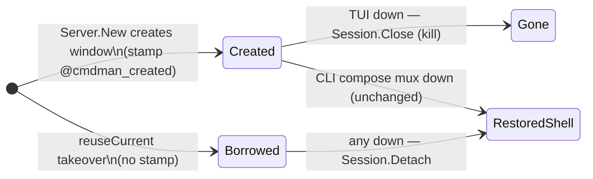
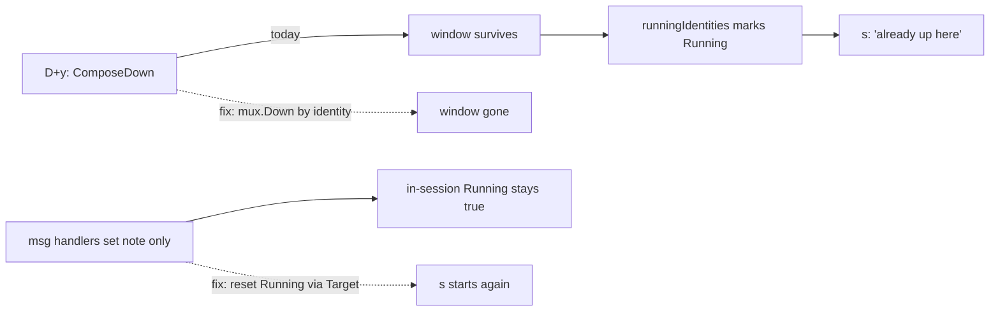

# PLAN — fix launcher restart-after-down; compose down removes the window

Fix the TUI launcher so a downed project can be started again, and make the
TUI's compose teardown remove the mux window the launch created.

## Goal / success criteria

1. In the launcher, `D` + `y` (compose down) followed by `s` starts the project
   again — no "already up here" refusal, in the same launcher session and in a
   freshly opened one.
2. `d` (mux down) followed by `s` rebuilds the dashboard in the same session.
3. A fully successful compose down issued from the TUI removes the project's
   mux window(s), including the bare shell window a landing synthesizes for a
   project with no `mux:` section (D9).
4. `d` issued from the TUI removes a window cmdman *created* outright — no
   leftover shell pane, no leftover frame. A window cmdman borrowed via the
   reuse-current-window takeover is still restored, and CLI
   `cmdman compose mux down` keeps today's restore behavior (D6).

## Non-goals

- Changing `cmdman compose down` CLI behavior (D3: window removal is
  TUI-only).
- Re-listing/refreshing the whole launcher listing after a down.
- Badge/attention surfaces for failures (existing D10 phase-2 deferral).

## Context — current behavior

Two independent legs cause bug (1):

- **In-session:** `cmdman/tui/widget/launcher/launcher.go` handles
  `core.ComposeDownMsg` / `core.MuxDownMsg` by setting only `m.note`
  (launcher.go:233-238). The row's `Running` flag — set true by
  `onStarted`/`onLanded` — is never reset, so `startEnabled`
  (launcher.go:913) skips the row via `p.Running` and says "already up here".
- **Cross-session:** `Running` derives from `runningIdentities`
  (cmdman/cli/tui_backend_launcher.go:210) — the set of mux window identities.
  `compose.Service.Down` (cmdman/compose/service_down.go:45) never touches
  mux, so the window survives the down and a fresh listing re-marks the
  project Running. This leg *is* bug (2).

Bug (2): `serviceBackend.ComposeDown` (cmdman/cli/tui_backend_compose.go:258)
calls `b.compose.Down` only; the dashboard window (or D9 shell window) stays
behind full of dead panes.

Bug (3) — `d` leaves a shell + frame: `mux.Down` (cmdman/mux/down.go:80) tears
down by `Session.Detach` (pkg/muxctl/tmux/detach.go), which *restores* the
window — collapses the project region to one default shell pane, leaves the
frame, unsets the ownership stamp. That is right for a window cmdman borrowed
(`reuseCurrent` takeover of the user's current window, cmdman/mux/run.go:175)
but wrong for a window cmdman created — which is every launcher/landing window
(`KeepCurrentWindow: true`; `mux.Land` creates via `Server.New`'s create
branch). Nothing today records which case a window is; a kill primitive exists
(`Session.Close` = kill-window, pkg/muxctl/tmux/tmux.go:238).





## Approach

1. **Carry the target in the down messages.** Add `Target core.DownTarget` to
   `core.MuxDownMsg` and `core.ComposeDownMsg`; populate it in `MuxDownCmd` /
   `ComposeDownCmd` (cmdman/tui/internal/core/commands.go). Additive — the
   switcher and projectmanager consumers compile unchanged.
2. **Reset the row on a finished teardown.** In the launcher's handlers, on
   `msg.Err == nil`, locate the row with `find()` (matches WorkDir+Project,
   both carried by `DownTarget`) and set `Running=false`, `starting=false`.
   This also makes `d`-then-`s` rebuild the dashboard: `bringUp` runs Up
   (no-op), `hasDashboard` is false, so `MuxUp` rebuilds.
3. **Stamp created windows; let down kill them (D5/D6).**
   - `pkg/muxctl/tmux`: in `Server.New`'s create branch (the `createWindow`
     path only — never the `WindowID` or reuse-takeover paths), stamp the new
     window with a `@cmdman_created` window option. Expose it as
     `muxctl.WindowRow.Created bool` via `ListWindows`.
   - `cmdman/mux`: add `DownOptions.KillCreated bool`. Per matching window:
     when set and the row is Created, `Open` + `Session.Close` (kill-window);
     otherwise `Detach` as today. Print "Removed window …" vs the existing
     "Restored window …".
   - `cmdman/compose`: add `MuxDownOption.KillCreated bool`, passed through
     to `mux.Down`. CLI `compose mux down` leaves it false (D6).
   - `cmdman/cli`: `serviceBackend.MuxDown` passes `KillCreated: true`.
4. **Remove the window on compose down.** In `serviceBackend.ComposeDown`,
   after a fully successful down (call error nil and `DownResultErr(result)`
   nil), best-effort `mux.Down` with `Identity:
   selection.ProjectIdentity()`, `Driver` from `selection.Spec.Mux.Driver`
   when the spec declares one, zero (autodetect) otherwise, `KillCreated:
   true`, `Stdout: io.Discard`. A window-removal failure does not fail the
   down — the commands are gone either way; surface it appended to the
   returned status only if cheap, else log it.

**Rejected:** routing window removal through `compose.Service.MuxDown` or
`compose.ResolveMuxSelectionByName` — both require a declared `mux:` section
(`MuxDown` dereferences `selection.Spec.Mux`, nil-panics), and the window may
be a D9 bare shell on a mux-less project. Call `cmdman/mux.Down` directly
(see DECISION.md D2).

**Rejected:** putting window removal inside `compose.Service.Down` — it would
change CLI `compose down` behavior too; the user chose TUI-only (D3).

**Rejected:** killing every window on down — the `reuseCurrent` takeover means
the window can be the user's own shell window; kill-window would SIGHUP their
shell (D5). **Rejected:** a TUI-side "always kill" flag without the created
stamp — the TUI cannot know per-window whether it was borrowed; `d` in the
switcher acts on windows brought up by CLI `mux up`, which may be takeovers.

## Public surface delta

```go
// cmdman/tui/internal/core/commands.go
type MuxDownMsg struct {
    Name   string
    Target DownTarget // added
    Err    error
}

type ComposeDownMsg struct {
    Name    string
    Target  DownTarget // added
    Summary DownSummary
    Err     error
}

// pkg/muxctl (driver.go)
type WindowRow struct {
    // ...existing fields...
    Created bool // added: window was created by cmdman (@cmdman_created)
}

// cmdman/mux/down.go
type DownOptions struct {
    // ...existing fields...
    KillCreated bool // added: kill created windows instead of restoring them
}

// cmdman/mux/list.go
type OwnedWindow struct {
    // ...existing fields...
    Created bool // added: mirrors muxctl.WindowRow.Created
}

// cmdman/compose/mux.go
type MuxDownOption struct {
    // ...existing fields...
    KillCreated bool // added: passed through to mux.DownOptions.KillCreated
}
```

Durable state vocabulary: new tmux window user option `@cmdman_created`
(value "1"), set by `pkg/muxctl/tmux` `Server.New` when it creates the window.

No CLI flags, config keys, or on-disk formats change. `cmdman compose mux
down` keeps restore behavior (D6). `serviceBackend` is unexported; its
`ComposeDown` signature is unchanged.

## Implementation steps

1. **core: target-carrying down messages.**
   `cmdman/tui/internal/core/commands.go`: add `Target DownTarget` to
   `MuxDownMsg` and `ComposeDownMsg`; set it in `MuxDownCmd` and
   `ComposeDownCmd`. Verify: `go build ./...`; switcher/projectmanager
   untouched.
2. **launcher: reset row state on teardown.**
   `cmdman/tui/widget/launcher/launcher.go`: replace the note-only
   `core.MuxDownMsg` / `core.ComposeDownMsg` cases with handlers that, on
   success, `find(target)` and clear `Running`/`starting`, then set the note.
   Verify: new unit tests in `launcher_test.go` — `D`+`y` then `s` issues
   `startProjectCmd`; `d` then `s` likewise; a failed down leaves `Running`
   as-is.
3. **muxctl + mux: created stamp and kill-on-down.**
   - `pkg/muxctl/tmux/tmux.go` `Server.New`: after `createWindow` succeeds,
     `set-option -w @cmdman_created 1` (a `createdOption` const beside
     `ownerOption`). Only that branch — never reuse-takeover or `WindowID`.
   - `pkg/muxctl` `ListWindows`: surface the option as `WindowRow.Created`
     (extend the tmux list format string); mirror onto
     `cmdman/mux.OwnedWindow.Created`.
   - `cmdman/mux/down.go`: add `DownOptions.KillCreated`; in the per-row
     loop, when set and `row.Created`, call `sess.Close` instead of
     `sess.Detach` and print "Removed window …".
   - `cmdman/compose/mux.go`: add `MuxDownOption.KillCreated`, passed to
     `mux.Down`; `cmd/cmdman/commands/compose_mux_down.go` stays as-is
     (false, D6).
   - `cmdman/cli/tui_backend_mux.go` `MuxDown`: pass `KillCreated: true`.
   Verify: driver-level test (pattern: existing pkg/muxctl/tmux tests) that a
   created window lists `Created=true`, a reused one false, and
   `Down{KillCreated:true}` kills the former and restores the latter.
4. **backend: compose down removes windows.**
   `cmdman/cli/tui_backend_compose.go` `ComposeDown`: on full success, call
   `mux.Down` by identity as described in Approach. Keep it testable: extend
   the seam pattern `startProject` uses (`launcherComposeSvc`) — introduce a
   small consumer-side func/interface for the mux teardown so a unit test can
   observe the call without a tmux server; wire the real `mux.Down` in the
   method. Verify: unit test that a successful down triggers the teardown
   with the right identity/driver, and a partial failure does not.
5. **e2e: launcher down→restart cycle.**
   `e2e/cmdman`: extend/add a tmux-driven test (pattern:
   `tui_widget_test.go`, `compose_up_mux_test.go`) —
   - up a project through the widget, `D`y through the widget, assert the
     window is gone (`mux ls` empty for the identity), then `s` starts it
     again and the window is back;
   - `d` on a widget-launched project: window gone entirely — no restored
     shell window, no frame — commands still running; `s` rebuilds it;
   - CLI `compose mux up` reuse-takeover window + `d`/CLI `mux down`:
     restored to a shell, not killed;
   - the mux-less (D9 shell window) case for compose down.

## Testing / verification

- Unit: launcher_test.go message-handling cases (step 2); backend seam test
  (step 3).
- E2E: step 4; `go test ./...` and existing e2e stay green.
- Manual: `bin/cmdman tui widget launcher` in tmux — `S`, `D`y, `s`, `d`, `s`.

## Risks

- `mux.Down` with a zero Driver autodetects from the environment; a dashboard
  built on a non-default socket is only found when the spec declares the
  driver — same limitation `runningIdentities` already has, so listing and
  teardown stay consistent.
- Other widgets (switcher, projectmanager) keep note-only handling; their
  rows refresh by re-listing, so no behavior change intended there. Their `d`
  gains the kill behavior via the shared `serviceBackend.MuxDown` — intended:
  the created stamp keeps borrowed windows safe.
- Windows created before this change carry no `@cmdman_created` stamp, so a
  TUI down restores them (old behavior) instead of killing. Acceptable: the
  app has no deployed installs to migrate (repo rule), and one more up/down
  cycle heals it.
- `Session.Close`'s kill-window SIGHUPs in-pane processes; mux panes run only
  viewers (attach/logs) and frame components, never supervised commands, so
  nothing supervised is affected (documented on Close).

## Open questions

None — Q1 resolved as D3 (TUI-only), Q2 resolved as D4 (leave the window on
partial failure), Q3 resolved as D5 (kill only created windows, via the
`@cmdman_created` stamp), Q4 resolved as D6 (kill-on-down is TUI-only; CLI
`compose mux down` keeps restore). See DECISION.md.
