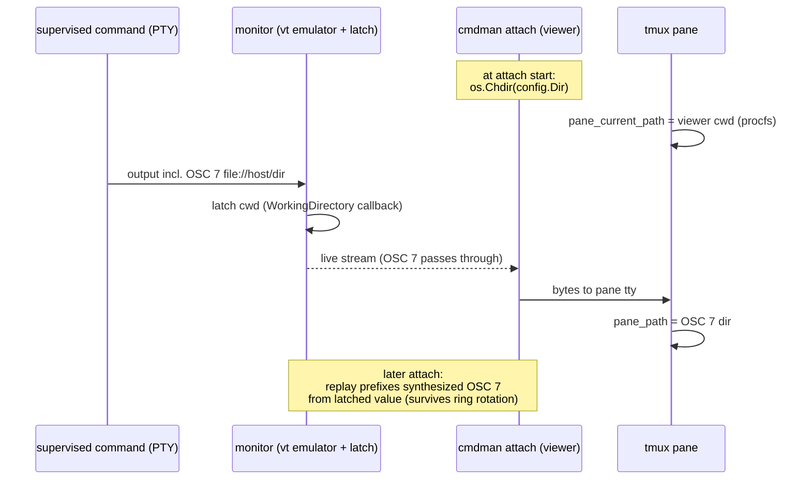

# Pane cwd reporting

Gate: confirmed by user, 2026-08-29

## How it should be

A tmux pane viewing a cmdman-supervised command should report that command's
working directory, so every cwd-aware tmux gesture — a floating-popup binding,
`split-window -c '#{pane_current_path}'`, status-line path segments — lands in
the directory the command runs in, not in `$HOME` or wherever the tmux session
happened to be born.

Two truths, layered:

- **Static truth** — the directory the command was configured to run in
  (`dir:` / `CommandConfig.Dir`). Always known, always correct as a baseline.
- **Dynamic truth** — where the program inside the command *currently* is,
  as the program itself reports via OSC 7 (shells with OSC 7 integration,
  fish, foot/vte snippets, starship). Better than static when available;
  absent for programs that never emit it.

The static truth reaches tmux by the viewer process chdir'ing (moves
`#{pane_current_path}`); the dynamic truth reaches tmux by the monitor
latching OSC 7 from the command's output and the attach replay re-emitting it
(moves `#{pane_path}`). They compose; neither is enough alone.

## Use cases

### U1 — floating popup from a dashboard pane

Actor: the user, inside a cmdman mux dashboard window, on a pane attached to a
supervised command. Intent: open their floating-window popup (a binding built
on `#{pane_current_path}`) and get a shell in the command's directory.

Walkthrough: the pane's process is `cmdman attach <id>`; it chdir'd to the
command's `Dir` at attach start, so tmux's procfs-derived
`#{pane_current_path}` is the command's directory. The popup opens there.
No binding change required.

### U2 — popup follows a shell command as it cd's

Actor: same user, but the supervised command is an interactive shell (or any
OSC 7-emitting program) that has since `cd`'d elsewhere. Intent: the popup
(or a `pane_path`-aware binding) follows the *current* directory.

Walkthrough: the shell emits OSC 7 on every cd; the monitor's VT emulator
latches it; while attached the raw sequence also flows through to tmux live.
A viewer that attaches later — after scrollback rotated the original
sequence out — receives a synthesized OSC 7 at replay start, so
`#{pane_path}` is correct from the first frame. Bindings that should follow
the dynamic truth read `pane_path` with a `pane_current_path` fallback.

### U3 — attach by hand from a terminal

Actor: the user running `cmdman attach <id>` in a plain terminal (no mux
involvement). Intent: unchanged behavior, no surprises.

Walkthrough: chdir of the viewer process is invisible in a plain terminal
(the user's shell keeps its own cwd; only the short-lived viewer moved).
The OSC 7 re-emit is a standard terminal courtesy — terminals that support
it (foot, wezterm, kitty) update their cwd tracking; others ignore it.
Output piped to a file must not receive escape garbage beyond what attach
already emits for title/screen; OSC 7 re-emit follows the same tty rules as
the existing replay sequences.

### U4 — command's directory no longer exists

Actor: user attaches to a command whose `Dir` was deleted after start.
Intent: attach still works.

Walkthrough: the viewer's chdir fails silently (best-effort, logged at
debug); the pane reports the viewer's inherited cwd, as today. The latched
OSC 7 (a string, no filesystem dependency) still re-emits.

## Flow

## Usability requirements

- Zero configuration: both mechanisms are on by default for every attach.
  No flag, no config key, nothing to discover — the pane is simply right.
- Never fail an attach for cwd reasons: chdir and re-emit are best-effort.
- Idempotent and quiet: re-attaching, replays, and identical OSC 7 values
  produce no visible churn and no duplicate hook noise.
- The static baseline exists before the command ever speaks: a freshly
  started silent command still reports its configured `Dir`.
