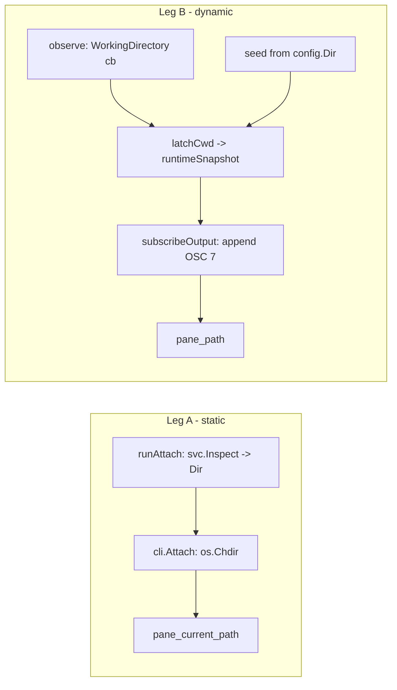

# Pane cwd reporting — implementation plan

Make every cmdman attach viewer report its command's working directory to the
terminal: `os.Chdir` for the static truth (`#{pane_current_path}`), an OSC 7
latch + replay re-emit for the dynamic truth (`#{pane_path}`).

## Goal / success criteria

- A tmux pane running `cmdman attach <id>` reports the command's configured
  `Dir` as `#{pane_current_path}` (U1).
- The switcher frame pane knows its own window: `M` manages the project of
  the window the pane lives in, regardless of what the client is viewing
  (D5), and the pane reports the project workdir as its cwd (D4/D6).
- A command that emits OSC 7 has its latest value latched by the monitor and
  re-emitted at the start of every attach replay, so `#{pane_path}` is right
  even after ring rotation (U2).
- Attach never fails, blocks, or garbles piped output because of either
  mechanism (U3, U4).

## Scope

- Viewer-side: chdir in the attach CLI path.
- Monitor-side: `WorkingDirectory` callback wiring, cwd latch in
  `commandRuntimeState`, seed from config, re-emit in `subscribeOutput`.
- Hook-filter accounting for the newly captured kind.
- Frame-side (D5/D6): the switcher frame pane gets `--mux-token <windowID>`
  from the frame builder — fixing the client-relative active-project bug
  observed on v0.0.23 — and then chdirs to the active group's workdir once
  identity + listing resolve.

## Non-goals

- tmux-driver `StartDirectory` / `split-window -c` changes (the alternative
  fix discussed for dashboard window/pane start dirs). Deliberately left out:
  this plan's two mechanisms cover the viewer panes; window-level start dirs
  are an independent improvement. Candidate HANDOFF entry if the user wants
  it tracked.
- Client-side parsing of the live stream to chdir dynamically (viewer follows
  static truth only; dynamic truth rides OSC 7).
- A hook event for cwd changes (`HookEventCwd`) — deferred by D3.
- Modifying `internal/third_party/` (D1) and any upstream issue (D1).

## Context (current behavior)

- `cmdman/monitor/terminal_screen.go:32-41` — `newScreenTracker` builds the vt
  emulator for TTY commands and calls `st.observe(t.term)`.
- `cmdman/monitor/runtime_state.go:112-131` — `observe` wires
  `vt.Callbacks{Bell, Title}` and `RegisterOscHandler(9/777, …)`. No
  `WorkingDirectory`.
- `internal/third_party/charmbracelet-x-vt/osc.go:106-125` —
  `handleWorkingDirectory` already fires `cb.WorkingDirectory(payload)` where
  payload is the **raw Pt string** (`file://host/path`), not a parsed path.
  `e.cwd` is write-only; no getter.
- `cmdman/monitor/mon_server.go:55-74` — `subscribeOutput` builds the replay:
  screen snapshot, `terminalState.Replay()`, then re-emits the latched title
  via `ansi.SetWindowTitle` when `runtime.TitleSet`. This is the exact
  precedent for the OSC 7 re-emit.
- `cmdman/monitor/hook_filter.go` — per-kind reasoning about which captured
  sequences are blocked from viewers; OSC 7 must be accounted for.
- `cmd/cmdman/commands/attach.go:45-115` — `runAttach` has `svc`
  (`*cmdman.Service`) in hand; `svc.Inspect(ctx, idOrName)`
  (`cmdman/cmdman_inspect.go:43`) returns the config carrying `Dir`.
- `cmdman/model/command_config.go:56-58` — `Dir` is validated non-empty, so
  the viewer always has a chdir target.
- `internal/third_party/charmbracelet-x-ansi/cwd.go:18` —
  `ansi.NotifyWorkingDirectory(host, paths...)` builds an OSC 7 sequence
  (available if we re-encode instead of replaying the raw payload).

## Approach

Two independent legs sharing no code, delivered in one plan because the user
experience (IDEA.md) needs both.

**Leg A — viewer chdir (static truth).** `runAttach` resolves the command's
`Dir` via `svc.Inspect` and passes it to the cli layer; `cli.Attach` /
`cli.AttachSticky` chdir best-effort before entering the stream loop. Chdir
lives in `cmdman/cli` (presentation layer owns terminal-adjacent behavior;
`./cmd` stays thin), happens once per process, after all flag/config path
resolution (config paths are already absolute by then).

**Leg B — monitor latch + re-emit (dynamic truth).** Mirror the title path
end to end: `WorkingDirectory: s.latchCwd` in `observe`; `latchCwd` sanitizes
and change-detects under the existing mutex; `runtimeSnapshot` grows
`Cwd`/`CwdSet`; `subscribeOutput` appends a re-emitted OSC 7 after the title
re-emit. The latched value is the raw Pt payload, so re-emit is
`"\x1b]7;" + cwd + "\x07"` verbatim — preserves the original host part and
avoids a parse/re-encode round trip. Seed the latch at monitor startup with
`file://localhost<config.Dir>` (via `ansi.NotifyWorkingDirectory`'s URL
logic or `url.URL` directly) so a silent command still reports its baseline.

**Rejected alternatives**

- *Public `Cwd()` getter on the vendored emulator* — needs no vendored change
  at all via the callback; see D1 and open question 1.
- *tmux `-c` plumbing (`mux.RunOptions.WorkDir`, `split-window -c`)* — fixes
  window start dirs, not per-command truth; orthogonal, deferred (non-goal).
- *Viewer parses stream for OSC 7 and chdirs to follow* — duplicate VT
  parsing client-side for marginal gain over `pane_path`.



## Public surface delta

No CLI flag, config key, or stored-format changes. Two additive surfaces:

```go
// cmdman/cli/attach.go — AttachOptions is exported, so this IS a public
// struct field addition:
type AttachOptions struct {
    // ... existing fields ...
    // WorkDir, when non-empty, is best-effort chdir'd into before the
    // attach loop, so a terminal multiplexer derives the pane's path from
    // the supervised command rather than from the invoker.
    WorkDir string
}
```

```proto
// api/schema/proto/cmdman/v1/cmdman.proto — additive field on the message
// shared by Status and WatchRuntimeState (D3):
message RuntimeState {
  string title = 1;
  ReportedStatus status = 2;
  string detail = 3;
  bool bell_unread = 4;
  string cwd = 5; // command's reported working directory (absolute path,
                  // parsed from OSC 7 or seeded from config dir); "" if unknown
}
```

Per D3's sub-decision, proto `cwd` is the parsed path; the raw `file://`
payload stays internal for the byte-exact replay re-emit.

```go
// cmdman/cmdman_runtime_state.go — the exported CLI-output struct mirrors the
// proto field so inspect/status/--format readers actually see it (D8):
type RuntimeState struct {
    // ... existing fields ...
    Cwd string `json:",omitzero"`
}
```

```sh
# cmd/cmdman/commands — the switcher widget gains project-manager's existing
# flag (D5); the frame builder passes it, and it stays usable by hand:
cmdman tui widget switcher --no-quit --mux-token '@42'
```

No `--workdir` flag anywhere (D6 rejected it).

## Implementation steps

1. **Latch (Leg B core)** — `cmdman/monitor/runtime_state.go`: add `cwd
   string` / `cwdSet bool` to `commandRuntimeState` and `Cwd`/`CwdSet` to
   `runtimeSnapshot` (+ `snapshot()` copy); add `latchCwd(payload string)`
   mirroring `latchTitle` per D2 (sanitizeTermString, change-detection, no
   cap, no hook emit); wire `WorkingDirectory: s.latchCwd` into `observe`'s
   `vt.Callbacks`. Verify: unit test beside existing runtime_state tests.
2. **Seed** — where the monitor constructs `commandRuntimeState` /
   `newScreenTracker` for a run, seed the latch with the config `Dir`
   encoded as `file://localhost<dir>` (percent-encoding via `url.URL`).
   Verify: snapshot reports CwdSet before any child output.
3. **Re-emit (Leg B delivery)** — `cmdman/monitor/mon_server.go`
   `subscribeOutput`: after the `TitleSet` block, when `runtime.CwdSet`,
   append `"\x1b]7;" + runtime.Cwd + "\x07"` to `sub.TerminalState`.
   Verify: subscribe-path unit test (existing tests around
   `subscribeOutput`/attach replay).
4. **Hook-filter accounting** — `cmdman/monitor/hook_filter.go`: document
   OSC 7 among captured kinds; it is idempotent state, never blocked from
   viewers, and (this plan) emits no hook. Verify: hook_filter tests still
   pass; comment matches `go-cmdman-review-checklist` docs expectations.
5. **Proto surface (D3)** — `api/schema/proto/cmdman/v1/cmdman.proto`: add
   `string cwd = 5;` to `message RuntimeState`; `buf generate` from `api/`;
   `runtime_state.go` `view()` parses the latched `file://` payload to an
   absolute path (unparseable → ""), and `protoRuntimeState`
   (`mon_server.go:407` area) copies it. Verify: existing
   Status/WatchRuntimeState tests extended with a cwd assertion.
6. **Viewer chdir (Leg A)** — `cmdman/cli/attach.go`: `WorkDir` field on
   `AttachOptions` (see delta); best-effort `os.Chdir` at the top of
   `Attach` (and once for `AttachSticky`, not per-reattach); debug-log
   failure via ctx logger. `cmd/cmdman/commands/attach.go`: fill
   `opts.WorkDir` from `svc.Inspect(attachCtx, args[0])` — tolerate Inspect
   failure by leaving WorkDir empty (attach must not gain a new failure
   mode). Verify: cli unit test with a temp dir; `go-edit-cobra` checklist
   for the cmd touch.
7. **Switcher token (D5)** — `cmd/cmdman/commands/tui_widget_switcher.go`:
   add `--mux-token` (mirror `tui_widget_projectmanager.go:76`; consider
   hoisting it to a persistent flag on the `widget` parent next to
   `--no-quit` — implementation's call); `cmdman/mux/frame.go`:
   `frameComponentArgv` (`:524`, used at `:212`) takes the enclosing
   window's id and appends `--mux-token <windowID>` to component argvs.
   `TUIWidgetOptions.MuxToken` → backend plumbing already exists
   (`cli/tui.go:50-70`). Verify: unit test on the built argv; manual —
   `M` in a dashboard while the client sits on another window.
8. **Frame chdir (D4/D6)** — `cmdman/tui/widget/switcher/switcher.go`: when
   the joined groups mark an active group (identity from the token, matched
   in `switcherGroups`), best-effort `os.Chdir(activeGroup.Workdir)` once
   per resolved value (re-chdir on change, skip when already there).
   Verify: unit test around the resolve hook; manual — popup binding on the
   focused switcher pane.
9. **E2E** — `e2e/cmdman`: a TTY command that emits OSC 7, then a fresh
   attach captures the replay prefix and asserts the synthesized OSC 7 (and
   the seeded baseline for a silent command). Per repo rule: e2e whenever
   existing tests don't cover the case.
10. **Docs** — `doc/man` attach page: one paragraph on cwd reporting (both
    legs, `pane_path` vs `pane_current_path`); note the new inspect/status
    `cwd` field where runtime state is documented; document `--mux-token` on
    the switcher widget where the widget flags are documented. The
    `go-cmdman-review-checklist` has a docs coverage section; satisfy it.

## Testing / verification

- Unit: latch (change-detect, sanitize, seed), subscribeOutput ordering
  (title then cwd), AttachOptions.WorkDir chdir behavior incl. missing dir.
- E2E as step 6.
- Manual: tmux popup binding on `#{pane_current_path}` over a dashboard pane;
  `tmux display -p '#{pane_path}'` after a `cd` in a supervised shell.
- `go test ./...`, golangci-lint (hooks run it), review skills:
  `go-cmdman-review-checklist`, `go-review-checklist`,
  `go-check-outdated-patterns`.

## Risks

- OSC 7 payload is attacker-ish input (raw bytes from the child): sanitize at
  the latch (existing `sanitizeTermString`), and re-emitting verbatim means a
  malformed URL reaches tmux — tmux ignores what it can't parse. Per D2 the
  bound matches latchTitle exactly (sanitize only, no cap — confirmed
  latchTitle has none).
- Chdir moves the viewer's cwd for its whole life: any *later* cwd-relative
  file open in the attach path would silently resolve elsewhere. Audit in
  step 5 (config/socket paths are absolute today).
- `AttachSticky` respawn ordering: chdir once, not per reattach, or a deleted
  dir logs on every restart cycle.

## Open questions

None — all resolved → DECISION.md D1 (no upstream issue), D2 (match
latchTitle, no cap), D3 (proto cwd as parsed path, no hook event), D4
(reopened: frame panes chdir, logs panes out), D5 (switcher --mux-token fix
in scope), D6 (frame workdir by self-resolve, no --workdir flag).
