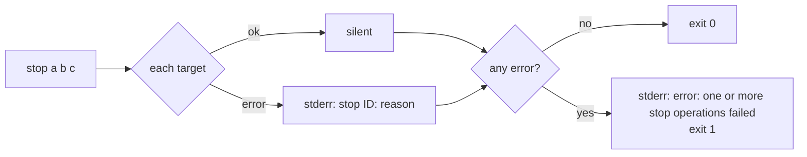
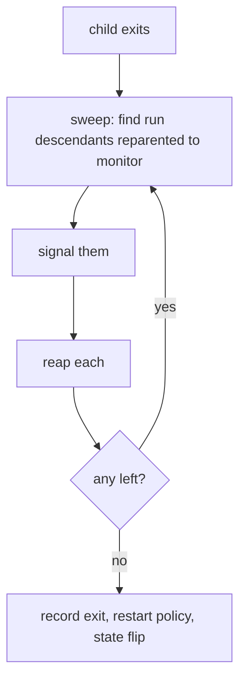

# TTY monitor wedge and `stop` exit status

Gate: confirmed by user, 2026-09-02 (same round that amended D4 to SIGTERM, grace, SIGKILL)

Source items: `doc/plan/issue/open/tty-monitor-wedges-when-grandchild-holds-pty-slave.md`
and `doc/plan/issue/open/stop-exits-zero-after-per-target-failures.md`. The
second was found while investigating the first; both land in `cmdman stop`,
so one plan covers both.

## How it should be

A supervised command's lifecycle is decided by **its own process**, never by
who else happens to hold its terminal. When the child exits, the run ends:
the exit code is recorded, the restart policy runs, and the state leaves
`running`. A helper the child left behind (a detached dev-server worker, a
language server, an agent, anything `nohup`/`setsid`-style) must not be able
to pin the monitor in `running` forever.

`cmdman stop` is honest about its outcome. It keeps trying every target, prints
each per-target failure, and then exits non-zero if anything failed, so
`cmdman stop … && cmdman rm …` in a script behaves as a reader expects.

## Use cases

### U1 — stop a TTY command whose grandchild keeps the pty open

Actor: a user, or a script. Situation: a TTY command (`run -t`) has spawned a
helper that ignores `SIGTERM`/`SIGHUP` (or left the session) and still holds
the pty slave. Intent: `cmdman stop <name>`.

Walkthrough:

1. `stop` sends the stop signal to the process group. The child exits; the
   helper survives.
2. The monitor notices the child exit at once, records the exit code, and
   flips the state to `exited` (restart policy suppressed by the stop).
3. `stop` returns within the child's own shutdown time, exit status 0.
4. `cmdman ls -a` shows `exited`; `cmdman rm <name>` succeeds without
   `--force`.

Today: step 2 never happens (the monitor's pty reader is parked in a blocking
`read(2)` that only returns when every slave fd closes), `stop` reports
`timeout waiting for stop, and SIGKILL failed: … no running process`, and the
command stays `running` until someone kills the helper by hand.

### U2 — a TTY command exits on its own while a helper still holds the pty

Actor: nobody; the command finishes (or crashes) by itself. Situation: same
survivor as U1. Intent: the state must reflect reality without any user
action.

Walkthrough:

1. The child exits. The monitor records the exit code and the state becomes
   `exited` (or `failed`/restarted per the restart policy) promptly, the same
   as a non-TTY command would.
2. `cmdman wait <name>` returns; event-log consumers see the terminal event.
3. The monitor sweeps the survivors: every process left over from the run
   is terminated and reaped before the run is considered finished, like a
   podman container run with `--init` whose main process exits — nothing
   the command spawned outlives the run (U5).

### U3 — the `SIGKILL` fallback reaches a lingering group

Actor: a user. Situation: the graceful signal did not end the run within the
timeout (a child that ignores `TERM`, or a run that is still winding down).
Intent: `stop -t N` escalates to `SIGKILL` and that escalation lands.

Walkthrough:

1. Timeout elapses; `stop` asks the monitor to `SIGKILL`.
2. The monitor signals the run's whole process group — even in the window
   after the child has been reaped but before the run is finished — and the
   run ends.
3. `stop` reports success or, if the run still does not end, a failure the
   user can act on (see U4).

Today the fallback answers `no running process` as soon as the child was
reaped, so the escalation never reaches the group.

### U4 — `stop a b c` where one target fails

Actor: a script, `cmdman stop a b c && cmdman rm a b c`. Situation: `b`
cannot be stopped (monitor unreachable in an unexpected way, timeout even
after `SIGKILL`, store error). Intent: the script must not proceed as if all
three stopped.

Walkthrough:

1. `stop` attempts all three, in order, never aborting early because of `b`.
2. stderr carries one line per failure: `stop <id>: <reason>`.
3. The process exits non-zero. The `&&` chain stops; the user sees the
   per-target line plus a one-line summary.
4. Exit status 0 means every target is now stopped (or was already
   stopped/absent).

### U5 — nothing a run spawned outlives the run

Actor: nobody; policy. Situation: a run ends (the child exited by itself, or
was stopped) and descendants are still alive — TTY or not, in the process
group or detached from it via `setsid`. Intent: the run's process tree is
gone before the state flips, so a restart does not stack survivors and a
stopped command holds no ports, files or terminals.

Walkthrough:

1. The child exits. Descendants that were still running are orphans; the
   kernel reparents them to the monitor (the monitor is their subreaper — no
   extra daemon, no PID namespace, no root: one `prctl` at monitor start).
2. The monitor reaps the ones already dead, sends `SIGTERM` to the rest,
   gives them a short fixed grace, `SIGKILL`s whatever is still alive, and
   reaps — looping until no descendant of the run remains. (A container
   would `SIGKILL` at once when its PID 1 exits; the grace is a deliberate
   softening, D4.)
3. Only then does the run end: exit code recorded, restart policy run, state
   flipped.
4. A hook process the monitor is running at that moment is untouched — hooks
   belong to the monitor, not to the run.

Non-Linux POSIX hosts have no subreaper: the sweep degrades to signalling the
run's process group, which still reaches everything that did not `setsid`.

### U6 — `compose stop` reports a target that failed to stop

Actor: a script or a user. Situation: `cmdman compose stop` on a project
where one command cannot be stopped. Intent: the per-command status shows
`error` for it and the command exits non-zero, the same as any other
per-target compose failure.

Today `compose stop` only looks at the call-level error and prints
`stopped` for a target whose own result carried an error. The same blind
spot exists in `compose restart`'s stop phase and in the reconcile path
that stops commands before recreating them.

## Usability requirements

- Defaults: orphan sweeping and the non-zero exit are the default
  behaviour; the one new flag (`--ignore-errors`) opts a script *out* of
  the non-zero exit while keeping the per-target lines.
- Feedback: per-target failures stay one line each on stderr, then a single
  summary line via the normal error path. Success stays silent.
- Failure experience: a stop that genuinely cannot complete still reports
  something actionable; the monitor logs where it is stuck instead of
  silently hanging (see Q3).
- Discoverability: the `stop` man page states the exit status contract.
- Consistency: the exit-status rule and its opt-out flag are the same for
  `stop`, `restart`, `rm` and `signal`; `compose stop` follows the compose
  family's existing `N compose action(s) failed` reporting.

## Open questions (idea level)

None open. Resolved 2026-09-02 (DECISION.md D1–D5): survivors are swept
and reaped (U5): reap, `SIGTERM`, short grace, `SIGKILL`, reap (D4); the exit-status rule covers all four verbs with
`--ignore-errors` as the opt-out (D2, D5); `compose stop` is fixed here
(U6, D3).
