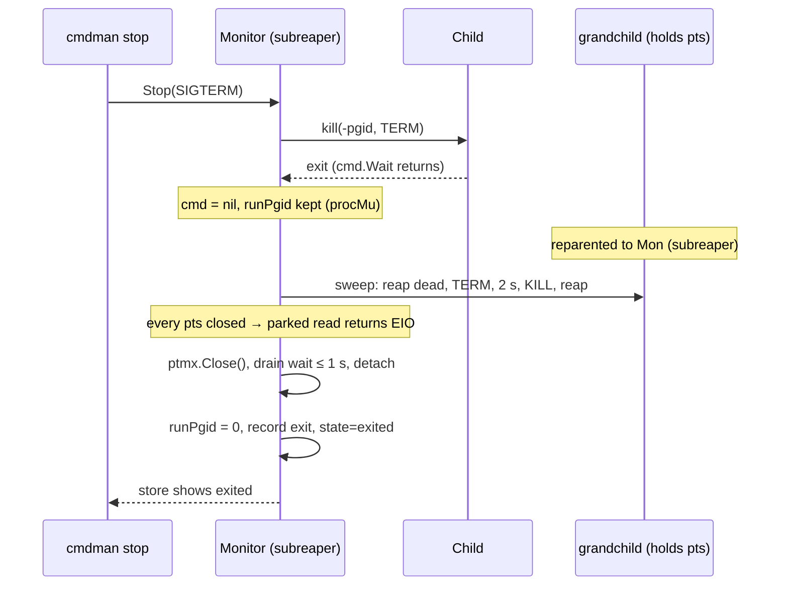

# TTY monitor wedge, run-survivor sweep, and multi-target exit status — implementation plan

Make a run end when its child exits regardless of who else holds the pty
(detach from the pty reader instead of trying to wake it);
sweep and reap everything the run spawned before the run is finished; let the
`SIGKILL` fallback reach the process group in the reap-to-finish window; make
`stop`/`restart`/`rm`/`signal` exit non-zero on a per-target failure unless
`--ignore-errors`; make `compose stop` see per-target stop failures.

Status: **finalized 2026-09-03 — no open questions (D1–D10).** Prerequisite:
`doc/plan/2026-08-16-02-monitor_proc_handle_race/` must be implemented
first (D7); its `procMu` is what guards the new `runPgid`.

## Goal / success criteria

- U1: the issue's reproduction (`run -t … trap "" TERM HUP; sleep 300 & …;
  exec sleep 300`, then `stop -t 3`) ends with state `exited` within the
  child's own shutdown time, and `rm` needs no `--force`.
- U2/U5: a command (TTY or not) that exits while a descendant is alive
  reaches `exited`/`failed`/restart promptly, and after the run ends no
  process of the run's tree exists (D4: reap, `SIGTERM`, 2 s, `SIGKILL`,
  reap). A hook running at that moment is untouched.
- U3: `Monitor.SignalProcess`/`StopProcess` reach the run's process group
  while the run has not finished, even after `cmd.Wait` returned.
- U4: `cmdman stop a b c` exits 1 when any result carries an error and 0 with
  `--ignore-errors`; all targets are attempted either way. Same for
  `restart`, `rm`, `signal` (D2, D5).
- U6: `compose stop` / `compose restart` / the reconcile stop phase report a
  per-target stop failure as an error outcome (D3).
- `go test ./...` (monitor package under `-race`) and the e2e suite pass; new
  e2e tests pin U1, U2/U5, U4, U6.

## Scope

- `cmdman/monitor/`: `mon_run.go` (`writeTty`, `runOnce`, `logCommandOutput`),
  `mon.go` (`SignalProcess`, `StopProcess`, new `runPgid`/`runGen` fields),
  `prep_process_posix.go` (`prepProcessAttrs`), new
  `orphans_linux.go` / `orphans_other.go` (subreaper + sweep).
- `cmd/cmdman/commands/{stop,restart,rm,signal}.go` and a shared helper.
- `cmdman/compose/service_stop.go`, `service_restart.go`,
  `service_reconcile.go`.
- `doc/man/cmdman-{stop,restart,rm,signal}.1.md` (Exit status + flag),
  `doc/man/cmdman.1.md` State Model (survivor sweep), `cmdman-compose-stop.1.md`,
  `cmdman-events.1.md` / `cmdman-inspect.1.md` (the two anomaly attrs and
  the `warnings` field, D10).
- `cmdman/model/command_config.go` (`CommandState.Warnings`).
- e2e tests under `e2e/cmdman/`, unit tests beside the code.

## Non-goals

- Reaping zombies *during* a run (tini does; here they wait for the run-end
  sweep — see Approach step 2 for why a `wait4(-1)` loop is unsafe next to
  `exec.Cmd`).
- Windows / plan9 (posix build tags stay; no subreaper outside Linux).
- Fixing the `m.cmd`/`m.stdin`/`m.ptmx` data race itself — that is the
  prerequisite plan's job (D7); this plan only adds `runPgid` under the
  `procMu` it introduces.
- A config key for the sweep grace (D4: constant).
- `wait`: its exit status is already correct and it gets no
  `--ignore-errors` flag (a wait that "ignores" a failed target has no
  useful meaning).

## Context (main @ a48baa6)

### The wedge — what the issue got right, and one thing it missed

- The ptmx reader goroutine: `cmdman/monitor/mon_run.go:255-266`; the
  `waitFn` that closes the ptmx and joins it: `mon_run.go:275-276`;
  `runOnce` nils `m.cmd` before calling `waitFn`: `mon_run.go:216-220`.
- `SignalProcess` refuses with `no running process` when `m.cmd == nil`:
  `cmdman/monitor/mon.go:463-468`; `StopProcess` delegates to it.
- Go runtime facts (go1.26.7, cited so nobody has to trust memory):
  - `(*os.File).Fd()` calls `f.pfd.SetBlocking()` when the file was
    non-blocking (`$GOROOT/src/os/file_unix.go:80-82`); `SetBlocking` sets
    `isBlocking = 1` permanently (`internal/poll/fd_unix.go:121-129`).
  - `poll.FD.Close` evicts the poll descriptor (which wakes a parked `Read`
    with `ErrFileClosing`) and then waits on `csema` **only when
    `isBlocking == 0`** (`internal/poll/fd_unix.go:91-118`). On a blocking
    fd it returns while the read is still parked and the fd still open.
  - `os.NewFile` registers the fd with the poller iff `F_GETFL` reports
    `O_NONBLOCK` (`os/file_unix.go:88-100` → `newFile(..., nonBlocking)`,
    `file_unix.go:144-155`).
- **The issue's fix #1 does not hold up.** (1) creack/pty v1.1.24 flips
  the master to blocking *inside `pty.Open`*, before any `Setsize`:
  `pty_linux.go` `open()` → `ptsname(p)` → `ioctl(f, …)` →
  `ioctlInner(f.Fd(), …)` (`ioctl.go:9`, "Fall back to blocking io"), so
  swapping the `Setsize`/`Getsize` sites alone changes nothing. (2) Making
  the ptmx pollable again (dup + `O_NONBLOCK` + `os.NewFile`) works on
  Linux/epoll only: the kqueue netpoller on Darwin/BSD does not handle tty
  devices reliably — Go itself excludes several file kinds from kqueue and
  silently falls back to blocking mode when `pfd.Init` fails
  (`os/file_unix.go:155-200`, issues #19093 #24164 #66239; the same
  limitation is why libuv routes tty fds around kqueue on macOS). cmdman
  builds for every `!plan9 && !windows && !wasm` target, so a Linux-only
  wake-up is not a fix. This is the premise behind
  `github.com/ngicks/go-common/iopipe`, already used by attach: "an
  operation already blocked in the underlying reader … is never
  interrupted" (`iopipe/doc.go:11-13`); the consumer detaches, the parked
  read is left to end on its own.
- `cmd.Wait` on the TTY path has no copy goroutines (stdio are `*os.File`
  slaves) and returns as soon as the child is reaped; the non-TTY
  `cmd.WaitDelay = 10s` (`mon_run.go:129`) only bounds the pipe copies.

### Survivor sweep — facts

- Monitor daemon: not a session leader (child of the `setsid` intermediate,
  `mon_spawn_posix.go` `forkMonitorDaemon`); one process per command; may
  run hooks concurrently via `hookDispatcher` (`hooks.go:205-210`,
  `exec.Cmd.Run` in an errgroup goroutine, `prepProcessAttrs(cmd, false)`
  → own pgid, monitor's session).
- Supervised child today: TTY → `pty.Start` sets `Setsid` (new session +
  ctty); non-TTY → `Setpgid` only (`prep_process_posix.go:22-27`), i.e.
  the child stays in the **monitor's session**.
- `golang.org/x/sys/unix` (direct dep, `go.mod:30`) has `Prctl`
  (`zsyscall_linux.go:1366`) and `PR_SET_CHILD_SUBREAPER = 0x24`
  (`zerrors_linux.go:2939`); `/proc/<pid>/stat` fields 4–6 give ppid, pgrp,
  session. `/proc/<pid>/task/<tid>/children` exists on this kernel but is
  `CONFIG_PROC_CHILDREN`-gated, so the `/proc/[0-9]*/stat` scan is the
  portable enumeration.
- Reparenting under a subreaper goes to the subreaper's thread group, so a
  reparented orphan's ppid is the monitor pid.

### Exit status — facts

- `runStop` prints `result.Err` and returns nil:
  `cmd/cmdman/commands/stop.go:64-69`. `restart.go:64-69`, `rm.go:59-64`,
  `signal.go:48-53` have the same shape.
- The precedent is **`wait`**, not `rm` (the issue's "matching how `rm`
  reports refusals" is wrong — `rm` also exits 0): `wait.go:66-80` sets
  `hadErr` and returns `errors.New("one or more wait operations failed")`;
  `main.go` prints `error: …` and exits 1.
- `Service.Stop` never aborts on a per-target error
  (`cmdman/cmdman_stop.go:42-49`); `Service.Signal` is one call per target
  (`signal.go:47-52`).
- No man page has an exit-status section today.

### compose — facts

- `service_stop.go:118`, `service_restart.go:192`, `service_reconcile.go:241`
  call `s.svc.Stop` and discard `[]StopResult`; `stopForRecreate`
  (`service_create.go:304-313`) is the correct shape to copy.
- `cli.StopResultErr` (`cmdman/cli/progress.go:192`) already turns
  `StopOutcome.Err` into a non-zero exit, so the CLI side needs no change.
- `compose down` stops through `reconcileStop` (`service_down.go:98` →
  `service_reconcile.go:184`).

## Prerequisite plan — quoted, not summarized

`doc/plan/2026-08-16-02-monitor_proc_handle_race/` (finalized 2026-08-16,
not started) lands before step 7 here. Its operative decision, R3,
verbatim:

> **R3 — one `procMu` over the trio, copy-under-lock readers** … Rename
> `stdinMu` → `procMu`; two short publish/clear sections in `runOnce`;
> readers copy the handle out and act on the copy (`QueueStdin` keeps
> holding across the write, preserving today's writer serialization).

This plan's `runPgid` joins that trio: published in the same section that
publishes `cmd`, cleared in a *later* section than the one that clears
`cmd` (after the sweep, step 6), read copy-under-lock by `SignalProcess`.

Boundary ledger (both plans carry it):

| Deliverable | Owner |
| --- | --- |
| `procMu` over `ptmx`/`stdin`/`cmd`; copy-under-lock readers | race plan, step 1 |
| Regression test: RPCs across a run's end under `-race` | race plan, step 2 |
| `runPgid` field, publish/clear under `procMu`, `SignalProcess` fallback | this plan, step 7 |
| Everything else in this plan | this plan |

## Approach



1. **Detach from the pty reader (D6, D9).** The run's end
   no longer joins the reader goroutine. After `cmd.Wait` and the sweep
   (step 2 — which, by killing every slave holder, is what actually makes
   the parked `read(2)` return with `EIO` on Linux), `waitFn` closes the
   ptmx best-effort, waits a short bound for the reader to drain trailing
   output into the log, and then moves on regardless. The reader goroutine
   owns the tail of its own life: it delivers to the ring/log/broadcaster
   only while its run is the current one (a per-run generation checked
   under `outputMu`; the run end bumps it right after the drain wait, so
   post-detach bytes are dropped rather than landing in the ring, the
   broadcaster or the next run's screen), and exits whenever its read
   finally returns. On a
   host without a subreaper an escapee can park one goroutine and one OS
   thread until it dies — the same bounded cost iopipe accepts.
2. **Subreaper + run-end sweep (D1, D4).** `RunMonitor` (Linux) calls
   `prctl(PR_SET_CHILD_SUBREAPER, 1)` once. After `cmd.Wait` returns,
   `runOnce` calls `sweepRunSurvivors`: enumerate direct children of the
   monitor whose session id is **not** the monitor's (every run descendant
   is in a session rooted at the child — D8 makes that true for non-TTY
   too; hooks are in the monitor's session); reap zombies with
   `wait4(pid, WNOHANG)`; `SIGTERM` the live ones; poll until gone or 2 s;
   `SIGKILL`; reap; repeat the enumeration (killed processes' children
   reparent to the monitor in turn) until empty, with a hard bound; on
   the bound, warn and record `survivors_unreaped=<n>` (D10). Targeted `wait4(pid)` — never `wait4(-1)`, which would steal
   the exit status of a hook `exec.Cmd` running at the same time. The
   sweep runs on `context.WithTimeout(context.Background(), sweepBound)`,
   not the monitor's ctx: on monitor shutdown that ctx is already
   cancelled, and that is exactly when survivors matter most.
   Non-Linux POSIX: `kill(-pgid, TERM)`, grace, `kill(-pgid, KILL)`, no
   reaping.
3. **pgid fallback (D7).** `runOnce` publishes the child's pgid under
   `procMu` before `setRunning` and clears it after the sweep;
   `SignalProcess` copies it under `procMu` and uses it when `cmd` is
   already nil.
4. **Run-end anomaly reporting (D10).** Two things can go wrong at run
   end without stopping the run from ending: the drain wait expires with
   the reader still parked, and the sweep's hard bound expires with
   survivors still alive. Neither is swallowed. Each is (a) logged at warn
   in the monitor log, (b) attached to the run's terminal event as
   `Attrs` so `cmdman events` shows it in the timeline, and (c) kept in
   `CommandState.Warnings` for the run so `cmdman inspect` shows it. The
   field is reset when the next run starts.
5. **Exit status (D2, D5).** A `cmd/cmdman/commands` helper turns
   `[]{ID, Err}` results into per-line stderr output plus a summary error,
   skipped by `--ignore-errors`.
6. **compose (D3).** A `firstStopErr(results)` helper in `cmdman/compose`,
   used at the three sites.

Rejected alternatives are in DECISION.md (D1–D9).

## Public surface delta

Authority: the fenced blocks. Prose only explains.

### Dependencies — no change

`golang.org/x/sys` and `github.com/creack/pty` are already direct
requirements; `pty.Setsize`/`Getsize` stay as they are.

### CLI

```sh
# stop / restart / rm / signal: exit 1 when any target failed, all attempted
$ cmdman stop a b c
stop 5d2c…: timeout waiting for stop after SIGKILL: context deadline exceeded
error: one or more stop operations failed
$ echo $?
1

# new flag on all four verbs: keep the per-target lines, exit 0 anyway
$ cmdman stop --ignore-errors a b c
stop 5d2c…: timeout waiting for stop after SIGKILL: context deadline exceeded
$ echo $?
0

$ cmdman restart --ignore-errors a b
$ cmdman rm --ignore-errors a b
$ cmdman signal --ignore-errors -s HUP a b
```

Flag: `--ignore-errors` (bool, default false, no short form) on `stop`,
`restart`, `rm`, `signal`. Summary messages: `one or more stop operations
failed` / `… restart …` / `… rm …` / `… signal …`. Call-level errors
(unknown target, store open) are unchanged and not covered by the flag.

### Man pages (new convention: `## Exit status` section)

```markdown
## Exit status

- `0`: every target was handled (or was already stopped / absent).
- `1`: at least one target failed; the per-target reasons precede the
  summary on stderr. `--ignore-errors` turns this into `0`.
```

Added to `cmdman-stop.1.md`, `cmdman-restart.1.md`, `cmdman-rm.1.md`,
`cmdman-signal.1.md`, each with the option bullet
`- --ignore-errors: exit 0 even when some targets failed; failures are
still printed.` `cmdman.1.md` State Model gains one paragraph: when the
command's process exits, every process it left behind is terminated
(`SIGTERM`, 2 s, `SIGKILL`) and reaped before the state changes; on
non-Linux hosts only the process group is signalled.

### Persistent data — one new JSON field (no DDL change)

`CommandState` is a JSON blob in the `CommandState.JSON` column; no
migration. The new field:

```go
// cmdman/model/command_config.go
type CommandState struct {
	// ... existing fields unchanged ...
	// Warnings lists run-end anomalies of the latest run that did not stop
	// the run from ending: "pty reader still blocked after 1s",
	// "3 survivor(s) still alive after sweep bound". Reset on each start.
	Warnings []string `json:"warnings,omitzero"`
}
```

Event attrs on the terminal event (`exited` / `failed`), all optional:

```json
{"type":"exited","id":"…","state":"exited","exit_code":0,
 "attrs":{"reader_detached":"true","survivors_unreaped":"3"}}
```

`reader_detached` is the literal `true`; `survivors_unreaped` is a decimal
count. Absent when nothing went wrong.

### Exported Go API — additive, monitor package only

```go
// cmdman/monitor/mon.go — no signature change on existing methods
func (m *Monitor) SignalProcess(sig syscall.Signal) error   // now reaches runPgid after reap
func (m *Monitor) StopProcess(sig syscall.Signal) error

// new unexported per-run fields
//   runPgid int          // under procMu (prerequisite plan's R3); leader pid, 0 when no run is live
//   runGen  uint64       // under outputMu; the pty reader compares its own copy before delivering (D6)
```

```go
// cmd/cmdman/commands/target_results.go — package-private helper, shown for shape
func reportTargetErrors(errOut io.Writer, verb string, ignore bool, errs iter.Seq2[string, error]) error
```

```go
// cmdman/compose/service_stop.go — package-private
func firstStopErr(results []cmdman.StopResult) error
```

### Proto, persistent data, project layout — no change

No proto field, no store column, no migration. New files live in existing
packages (`cmdman/monitor/orphans_linux.go`, `orphans_other.go`;
`cmd/cmdman/commands/target_results.go`).

## Implementation steps

Each step is one commit and independently verifiable. Steps 1–3 do not
touch the monitor and can start at once. Step 0 (the prerequisite plan)
precedes **every** monitor step (4–7): steps 4 and 6 rewrite the same
`runOnce` publish/clear lines that plan's step 1 rewrites.

0. **Prerequisite** — implement
   `doc/plan/2026-08-16-02-monitor_proc_handle_race/` steps 1–4 (D7).
   Verify per that plan; this plan's STATUS tracks it as a row.

1. **`reportTargetErrors` + `--ignore-errors` on stop/restart/rm/signal**
   — `cmd/cmdman/commands/target_results.go`, edits in the four verb files
   (`go-edit-cobra` skill applies). Unit test on the helper (verb in
   message, ignore flag). Delivers D2, D5, IDEA U4.
2. **Man pages** — `## Exit status` + option bullet in the four pages;
   the D10 attrs/field in `cmdman-events.1.md` and `cmdman-inspect.1.md`
   (can trail step 6). Delivers the "Discoverability" requirement.
3. **compose `firstStopErr`** — `service_stop.go`, `service_restart.go`,
   `service_reconcile.go`; unit test with a fake `cmdmanSvc` returning a
   per-target error and asserting the outcome error. Delivers D3, IDEA U6.
4. **Detach from the pty reader** — `writeTty`/`runOnce`: per-run
   generation on `Monitor` (under `outputMu`), reader delivers only while
   current; `waitFn` = close ptmx, bounded drain wait (`readerDrainWait`,
   1 s, D9), on expiry warn + record `reader_detached` (D10), bump
   `runGen`, return. Unit test (`-race`): child spawns a slave
   holder that ignores `TERM`; with the sweep stubbed out, the run still
   ends within the bound, the exited event carries
   `reader_detached=true`, `inspect` shows the warning, and a later run's
   output is not polluted by the stale reader. Delivers IDEA U1 step 2,
   D6, D9, D10.
5. **Non-TTY child in its own session (D8)** — the supervised child gets
   `Setsid` on both the TTY and the pipe path; **hooks keep `Setpgid`**
   (`execHook`, `hooks.go:209`, calls `prepProcessAttrs(cmd, false)` today
   and must stay in the monitor's session, or step 6 would sweep a running
   hook). Split `prepProcessAttrs` into `prepCommandAttrs(cmd, tty)` and
   `prepHookAttrs(cmd)`. Existing e2e (`stop`, `signal`, restart policy,
   hooks) verifies nothing regressed. Prerequisite for step 6's
   classification.
6. **Subreaper + sweep** — `orphans_linux.go`: `becomeSubreaper()`,
   `sweepRunSurvivors(ctx, logger, runPgid)`; `orphans_other.go`: group
   signal only; call sites in `RunMonitor` and `runOnce` (sweep runs
   *before* the drain wait of step 4, so killing the slave holders is what
   ends the parked read). Unit test (Linux): run
   `sh -c 'setsid sleep 300 & sleep 300 & exit 0'`-style child, assert both
   survivors are gone and reaped (no zombie in `/proc`) after the run
   ends, and that a concurrently running fake hook process is untouched
   (this test is what pins the step-5 split); a second test with a
   `SIGKILL`-immune stand-in is not feasible, so the bound path is unit
   tested by injecting a short `sweepBound` against a `sleep` that is
   never signalled (sweep with the kill step stubbed). Delivers D1, D4,
   D10, IDEA U5.
7. **pgid fallback** — `Monitor.runPgid` under `procMu` (D7),
   published/cleared in `runOnce`, copied by `SignalProcess`. Unit test
   (`-race`): `SignalProcess` after `cmd.Wait` but before sweep end
   reaches the group. Delivers IDEA U3.
8. **e2e** — `TestStop_TtySurvivorHoldsSlave` (U1: issue reproduction,
   `stop -t 3` succeeds, state `exited`, `rm` without `--force`, survivor
   pid gone); `TestRun_ExitWithSurvivors` (U2/U5: `sh -c 'setsid sleep
   300 & exit 0'` reaches `exited` promptly and the survivor is gone);
   `TestRm_ExitStatusOnFailure` + `_IgnoreErrors` (U4, via
   `runExpectFail`): `rm` on a running command without `--force` is the
   one deterministic per-target refusal ("command is running, use --force
   to remove"); a removed monitor socket does not work for `stop` because
   `isMonitorUnavailable` → `MarkMonitorDied` returns nil, and the wedge
   stops existing at step 4. `stop`/`restart`/`signal` wiring is pinned at
   unit level through `reportTargetErrors`;
   `TestComposeStop_ReportsTargetFailure` (U6). Survivors in these tests
   are found via a pid file the shell writes under the test's temp dir,
   and `t.Cleanup` kills them in case the sweep did not. `setsid(1)` is
   util-linux: the tests that need an escapee `t.Skip` when it is not on
   `PATH`; the U1 reproduction needs no `setsid`.
9. **Close the two issue items** — move both files to
   `doc/plan/issue/closed/`, regenerate `catalog.md` per
   `reference/issue-backlog.md`. After merge, on the user's say-so.

## Testing and verification

- `go test ./cmdman/monitor/ -race -run 'Detach|Sweep|Pgid'` for steps 4–7.
- `go test ./cmd/... ./cmdman/compose/...` for steps 1, 3.
- `go test ./e2e/...` full, plus the new tests under `-count=3`.
- Hooks e2e (`e2e/cmdman/hooks_test.go`) after step 5, since hook exec
  attrs move to their own helper.
- Manual: the issue's reproduction on a built binary (`go build -o
  bin/cmdman ./cmd/cmdman`).
- `golangci-lint run` (hooks run it on every edit).

## Risks

- A detached reader that outlives its run must never write into the next
  run's ring/log; the generation check is the only guard. Mitigated by the
  step-4 pollution test.
- On hosts without a subreaper, an escapee holding the slave parks one
  goroutine + one OS thread until it dies; a command that does this on
  every restart leaks one per restart. Accepted (iopipe contract); logged.
- Session-based classification (step 6) is only sound if every supervised
  child is a session leader (step 5). A hook is never misclassified because
  a process cannot join the monitor's session from outside it.
- `wait4` on a pid the monitor did not spawn is legal only because it is
  the (sub)reaper parent; on non-Linux the sweep does not reap.
- A `D`-state survivor ignores `SIGKILL`; the sweep's hard bound (10 s)
  logs and gives up rather than wedging the run again.
- `Setsid` for non-TTY children: a child that opens a tty device without
  `O_NOCTTY` could acquire it as its controlling terminal. Negligible for
  pipe-driven commands.

## Open questions

None. Q1–Q3 resolved in IDEA.md (D1–D3), Q4 → D9, Q5 → D7, Q6 merged into
D6/D9, Q7 → D8.

## Traceability

| Decision clause | Owning step |
| --- | --- |
| D1 "makes itself the subreaper … `prctl(PR_SET_CHILD_SUBREAPER)`" | 6 |
| D1 "terminates and reaps every process the run left behind" | 6 |
| D1 "Non-Linux POSIX degrades to signalling the run's process group" | 6 (`orphans_other.go`) |
| D2 "attempt every target, print one `verb ID: reason` line per failure, exit 1" | 1 |
| D2 "unless the opt-out flag is set" | 1 |
| D3 three compose sites "surfaces the first per-target error as the outcome error" | 3 |
| D4 "reaps what is already dead, sends `SIGTERM` … `orphanGrace` (2 s) … `SIGKILL`s the rest, and reaps until nothing remains" | 6 |
| D5 "`--ignore-errors`" | 1, 2 (man) |
| D6 "never joins the goroutine parked in `ptmx.Read`" | 4 |
| D6 "closes the ptmx, waits a short bound for trailing output, and detaches" | 4 |
| D6 "stale reader is fenced off from the next run by a per-run generation" | 4 |
| D7 "prerequisite plan lands first; `runPgid` under its `procMu`" | 0, 7 |
| D8 "supervised child `Setsid` on both paths; hooks keep `Setpgid`" | 5 |
| D9 "`readerDrainWait` 1 s, warn on expiry" | 4 |
| D10 "logged at warn, attached to the terminal event as `Attrs`, kept in `CommandState.Warnings`" | 4 (reader), 6 (sweep) |
| D10 "reset when the next run starts" | 4 |
| IDEA U1 | 4, 6, 8 |
| IDEA U2 / U5 | 5, 6, 8 |
| IDEA U3 | 7, 8 |
| IDEA U4 | 1, 2, 8 |
| IDEA U6 | 3, 8 |
| Contract areas: deps / CLI / man / Go API / proto / data / layout | each fenced or "no change" above |
